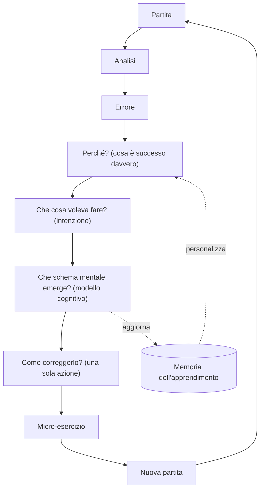
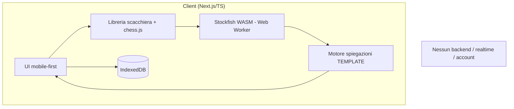
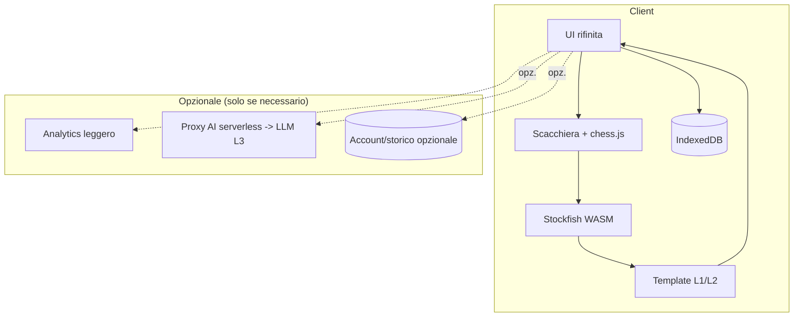
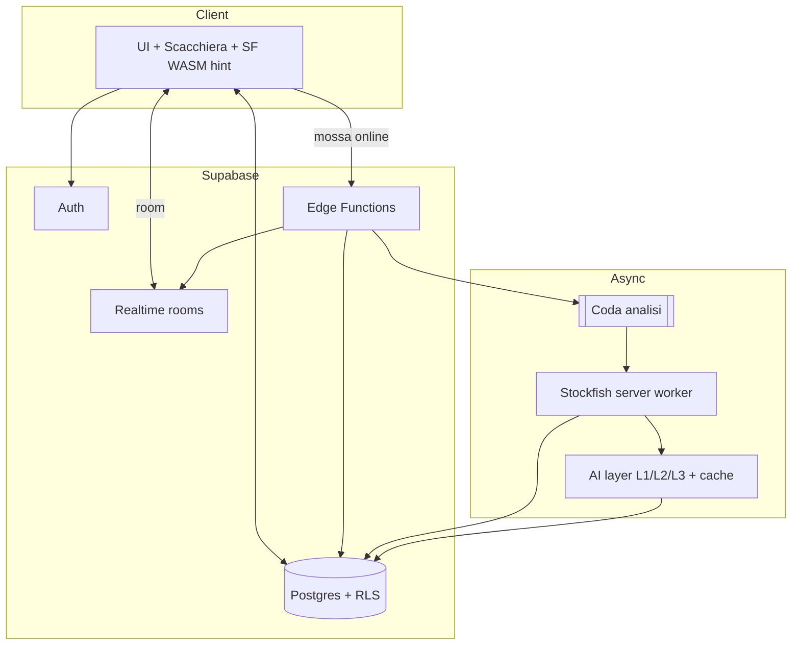

# Piano di Sviluppo — Web App per Imparare e Giocare a Scacchi

> Documento tecnico e di prodotto. **Fase di progettazione**: nessun codice, nessuna dipendenza, nessuna implementazione. Serve a essere revisionato prima di autorizzare lo sviluppo.
>
> Data: 2026-07-13 · Revisione: **v3 — filosofia di prodotto in primo piano (da piano tecnico a PRD)** · Stato: Draft per revisione · Autore: Progettazione tecnica + Product (Architect / Product / UX / TPM)
>
> Nome di lavoro del prodotto: **"Pensa" (working title)** — sostituibile in fase di branding (vedi §36 e §37).

> **Tesi di prodotto (v3).** Questo **non** è "una piattaforma di scacchi con l'AI". È:
>
> ## **L'app che ti insegna a *ragionare* negli scacchi.**
>
> Il riferimento mentale non è una piattaforma scacchistica. È **Duolingo che incontra un coach personale**: un percorso breve, gentile, quotidiano, che corregge *come pensi* mentre giochi — non che ti mostra la mossa del motore. Le persone non perdono perché non conoscono Stockfish; perdono per **abitudini di ragionamento** (non vedono una minaccia, non considerano abbastanza alternative, giocano d'impulso). **Il prodotto corregge comportamenti cognitivi, non insegna mosse.** Tutta la **Parte I** (Filosofia di prodotto) precede volutamente la parte tecnica: se un lettore legge solo la Parte I, deve capire *perché* questa app dovrebbe esistere.

> **Nota di lettura (v2, invariata).** Rispetto alla v1, il piano non descrive più un unico MVP monolitico né una sola architettura definitiva. Tutto è organizzato su **quattro livelli progressivi**, e ogni scelta tecnica è ancorata al livello in cui diventa *davvero* necessaria:
>
> - **A. Prototipo tecnico** — dimostra che il flusso educativo centrale è tecnicamente fattibile. Nessun backend obbligatorio.
> - **B. MVP Core** — valida con utenti reali che quel flusso è *utile*. Backend introdotto solo se serve.
> - **C. MVP completo / V1** — prodotto completo, introdotto **solo dopo validazione**: account, cloud, multiplayer, realtime, missioni, XP, lezioni estese, puzzle, skill profile avanzato, Stockfish server-side.
> - **D. Post-V1** — funzionalità future (personalità bot, Maia, insegnante, ecc.).
>
> Il principio guida di questa revisione è: **niente infrastruttura prima della prova del valore**. Elenco completo delle parti spostate/eliminate e delle decisioni cambiate rispetto alla v1 in coda al documento (§Changelog, dopo §41).

---

## 1. Executive summary

Si propone una web app **mobile-first** che **insegna a ragionare negli scacchi** a principianti e intermedi (400–1400 Elo). Non è una piattaforma per giocare con l'AI incollata sopra: è un **coach cognitivo** — *Duolingo + coach personale* — che osserva *come* giochi, individua gli **schemi mentali** che ti fanno perdere e li corregge un pezzo alla volta. Il motore e l'AI sono infrastruttura **invisibile**; ciò che l'utente percepisce è "**finalmente ho capito**", non "che bella AI".

**La UNICA cosa che l'MVP deve validare (ipotesi centrale):**
> **Le persone imparano davvero di più se l'app spiega il loro *ragionamento* invece della sola mossa migliore?**

Tutto il resto — bot, lezioni, skill profile, AI, storico — è **strumento al servizio di questa domanda, non oggetto di validazione**. Se questa ipotesi non regge, nessuna feature la salva; se regge, il prodotto ha una ragione di esistere che nessuna piattaforma esistente presidia.

**Il documento evita deliberatamente di costruire prima di aver validato questa tesi.** Perciò lo sviluppo è stratificato:

- **Prototipo tecnico (A):** scacchiera completa, bot (max 3 livelli), salvataggio **locale** (IndexedDB), analisi **Stockfish WASM client-side**, selezione di **3 momenti educativi**, **intenzione post-partita**, spiegazione **inizialmente via template deterministici**, replay dell'errore. **Nessun account, nessun realtime, nessun backend obbligatorio, AI non obbligatoria.**
- **MVP Core (B):** tutto il prototipo + UX mobile-first rifinita, 3–5 livelli bot, storico locale (account opzionale *leggerissimo*), review strutturata, classificazione educativa, replay guidato, intenzioni, **5 lezioni fondamentali**, **skill profile semplice (max 5 macro-competenze, senza percentuali fittizie)**, analytics essenziali, raccolta feedback. **Opzionali:** auth, cloud, LLM, modalità locale 2 giocatori. **Esclusi:** multiplayer realtime, 15–20 lezioni, missioni avanzate, XP/badge/streak complessi, bot con personalità, Maia.
- **MVP completo / V1 (C):** multiplayer privato via link, account+cloud, Stockfish server-side, job queue, Realtime, missioni, XP, 15–20 lezioni, puzzle dalle proprie partite, skill profile persistente, PWA completa, report — **solo dopo che i dati di validazione lo giustificano**.

**Raccomandazioni tecniche chiave (motivate, ma con scelta esplicita per livello e reversibilità in §41):**

- **Prototipo/Core:** Next.js + TypeScript + libreria scacchiera (Chessground vs React Chessboard — decisione condizionata dalla **licenza**, §32) + chess.js + **Stockfish WASM in Web Worker** + **IndexedDB**. Backend introdotto in Core **solo se** serve (account/analytics/proxy AI).
- **AI a tre livelli:** L1 template deterministici → L2 template combinati → L3 LLM che *riscrive* una spiegazione già determinata dal sistema. L'AI **non decide mai** valutazione/mossa/tema tattico, **è disabilitabile senza rompere la review**, ha fallback completo. Confronto **A/B template vs AI** in fase di validazione.
- **Analisi:** client-side nel prototipo/Core; passaggio a **server-side solo se soglie misurabili** lo impongono (§15); architettura **ibrida** prevista (client preliminare + server opzionale/premium, cache per posizione, solo posizioni decisive).

**Rischi principali:** peso/latenza Stockfish su mobile, qualità/selezione dei momenti educativi, utilità percepita delle spiegazioni, **scope eccessivo** (motivo di questa revisione), licenze copyleft. Mitigazioni in §31.

**Prossimo passo (§38):** approvare la **Parte I (filosofia di prodotto)** e la stratificazione (§6), poi la **tabella decisionale (§41)**, poi **Fase 0** (spike minimi + **gate licenze bloccante**), poi Prototipo.

---

# PARTE I — Filosofia di prodotto

> Questa parte è nuova (v3) ed è **la più importante del documento**. Definisce *perché* l'app esiste e *quali comportamenti* cambia. La parte tecnica (dalla §2 in poi) è al servizio di questa. Le sezioni sono lettera-numerate (I.A … I.F) per non alterare la struttura a 38 sezioni della Parte II.

## I.A — Filosofia dell'apprendimento

**Gli esseri umani non perdono perché non conoscono il motore.** Perdono per **abitudini di ragionamento**. Le più comuni nel target (400–1400):

- non **vedono una minaccia** dell'avversario;
- non **considerano abbastanza alternative** prima di muovere;
- hanno **paura di perdere un pezzo** e giocano passivi (o al contrario si aggrappano al materiale);
- **attaccano troppo presto**, prima di sviluppare e mettere al sicuro il re;
- giocano **d'impulso**, soprattutto sotto pressione;
- **fissano l'attenzione sulla parte sbagliata** della scacchiera (guardano i propri pezzi, non quelli avversari; un lato, non l'altro).

**Conseguenza per il prodotto:** l'app **non insegna mosse**, **corregge questi comportamenti**. Una lezione non è "in questa posizione gioca Cf3": è "**hai mosso senza controllare le minacce avversarie — facciamolo diventare un'abitudine**". La mossa giusta è un mezzo; il fine è il **cambiamento del processo di pensiero**. Questa è la differenza tra un analizzatore di partite e un coach — ed è la ragione per cui il valore non è replicabile incollando un motore a una scacchiera.

## I.B — Il loop cognitivo (diagramma principale del prodotto)

> **Questo — non il diagramma architetturale — è il diagramma centrale del documento.** L'architettura (§10) esiste solo per far girare questo loop.



Ogni tappa ha un padrone preciso: **Analisi/Errore/Perché** = motore (deterministico); **Intenzione** = l'utente; **Schema mentale** = modello cognitivo (§I.E); **Correzione + micro-esercizio** = didattica; **Memoria** = §I.F. L'AI, quando c'è, **riscrive** il testo di "Perché/Come correggere" — non decide nessuna di queste tappe.

## I.C — Product Principles (max 10)

Regole non negoziabili. Ogni feature, copy e decisione di design deve poter essere giustificata rispetto a queste.

1. **Insegna un concetto alla volta.**
2. **Correggi il processo, non la singola mossa.**
3. **Premia il miglioramento, non le vittorie.**
4. **L'AI non prende decisioni scacchistiche.** (Le prende il motore; l'AI al massimo riformula.)
5. **Ogni review termina con un esercizio.**
6. **Nessuna spiegazione supera 150 parole.**
7. **Ogni errore deve essere trasformabile in allenamento.**
8. **Nessun numero senza significato educativo.** (Niente "62%" fine a sé stesso.)
9. **L'utente deve percepire il miglioramento.** (La memoria, §I.F, lo rende visibile.)
10. **Ogni feature deve aiutare a giocare meglio** — se non lo fa, non entra.

> Questi principi sono **vincolanti** e vengono richiamati come criteri in Definition of Done (§35) e nella tabella decisionale (§41).

## I.D — Principi educativi (regole di interazione)

Come i Product Principles diventano comportamento concreto della review e delle lezioni:

- **Mai spiegare più di 3 errori** per partita. Meglio 1 ben compreso che 10 dimenticati.
- **Mai due concetti nuovi insieme.** Un solo concetto per volta, fino all'abitudine.
- **Mai linguaggio tecnico se non richiesto.** "Il tuo re era esposto", non "profilassi contro l'iniziativa sull'ala di re".
- **Ogni review si chiude con UNA sola azione concreta e comportamentale.** Non "hai sbagliato", ma:
  > *"Nella prossima partita, controlla sempre se il pezzo che hai appena mosso è protetto."*
- **La spiegazione parte dall'intenzione dell'utente**, non dalla verità del motore: prima "capisco cosa volevi fare", poi "ecco perché non ha funzionato".
- **Tono da coach, mai da esaminatore.** Incoraggiante, breve, specifico.

Queste regole sono **verificabili** (lunghezza ≤150 parole, ≤3 errori, esattamente 1 azione finale) e diventano criteri di test (§27) e di accettazione (§34).

## I.E — Modello Cognitivo del Giocatore

> **Non è lo skill profile.** Lo **skill profile misura *ciò che sai*** (tattiche, finali…). Il **Modello Cognitivo misura *come pensi***. È il vero asset differenziante del prodotto e il candidato "wow".

Invece di punteggi astratti tipo `Tattica 65%`, il modello descrive **pattern di comportamento osservabili**, in linguaggio umano. Esempi del tipo di insight (illustrativi):

```
Prima di muovere consideri in media 1,2 mosse candidate.
I giocatori della tua forza ne considerano 2,8.
```
```
Quando vieni attaccato, giochi il 40% più velocemente.
```
```
Controlli il lato di re, ma ignori spesso quello di donna.
```
```
Guardi soprattutto i tuoi pezzi, raramente quelli avversari.
```

**Cosa lo alimenta (segnali comportamentali, non solo scacchistici):** tempo per mossa (e la sua variazione sotto pressione), coerenza tra intenzione dichiarata ed effetto, tipo ricorrente di errore (materiale/minacce/sviluppo/re), lato della scacchiera degli errori, reazione dopo una cattura avversaria. **Molti di questi segnali sono raccoglibili anche client-side**, senza AI.

**Onestà statistica (Principle 8):** un insight compare **solo** quando c'è evidenza sufficiente; altrimenti resta "in osservazione". Nessun numero preciso senza dati che lo giustifichino. Nel Prototipo/Core il modello cognitivo può partire da **1–2 insight robusti** (es. numero di mosse candidate stimato, velocità sotto attacco); l'espansione è V1. *(Relazione con lo skill profile semplice in §19.)*

## I.F — Memoria dell'apprendimento

L'app **ricorda il percorso**, non solo le partite. È ciò che trasforma l'uso in **soddisfazione** e retention: rende il miglioramento **visibile**.

```
Un mese fa perdevi spesso la Donna. Oggi non succede quasi più.
```
```
Prima non arroccavi. Nelle ultime 8 partite hai arroccato sempre.
```

**Cosa serve:** confronto tra finestre temporali dello stesso comportamento (errore-tipo, arrocco, mosse candidate…) e messaggi generati **solo su trend reali** (mai lodi vuote). Nel Prototipo la memoria è **locale** (IndexedDB) e minimale (1–2 confronti); persistente e ricca in V1. È il correlato UX del Product Principle 9 ("l'utente deve percepire il miglioramento").

## I.G — L'AI deve essere invisibile

Rischio da evitare: che il prodotto diventi *"ChatGPT sugli scacchi"*. Deve essere un **coach cognitivo**. Perciò:

- L'AI **non è mai il protagonista** dell'interfaccia; non c'è "chatta con l'AI" al centro.
- L'utente non deve pensare "che bella AI", ma "ho capito perché sbaglio".
- L'AI (quando attiva, L3 in §16) **riscrive** spiegazioni già determinate dal sistema, entro i limiti dei Principi (≤150 parole, 1 azione, no gergo). È **disattivabile senza rompere nulla**.
- Il valore percepito nasce dal **loop cognitivo (§I.B)** e dalla **memoria (§I.F)**, non dalla generazione di testo.

---

# PARTE II — Piano tecnico e di prodotto

## 2. Visione del prodotto

> **"Non mostrare la mossa migliore: insegnare a ragionare meglio."**

La visione è quella già enunciata nella **Parte I**: un **coach cognitivo** che corregge *come pensi*, sul modello *Duolingo + coach personale*. Qui se ne fissa la meccanica operativa — il **loop cognitivo (§I.B)**:

1. Il giocatore gioca (contro bot; in locale; in V1 anche con un amico).
2. Dopo la partita, per **massimo 3** momenti realmente istruttivi, l'app chiede *cosa voleva ottenere*.
3. Il motore calcola in modo deterministico cosa è successo (verità scacchistica).
4. L'app parte dall'**intenzione** e spiega — in ≤150 parole, senza gergo — *perché* il ragionamento non ha funzionato.
5. Ne estrae uno **schema mentale** (modello cognitivo, §I.E) e chiude con **una sola azione concreta** + un micro-esercizio.
6. La **memoria dell'apprendimento (§I.F)** registra il trend e lo rende visibile nel tempo.

Il motore e l'AI sono **infrastruttura invisibile**, non protagonisti. **Prima si dimostra che questo loop cambia il modo di giocare (Prototipo→Core), poi lo si scala (V1).**

---

## 3. Proposta di valore

Il valore non è "analizzare partite": è **cambiare il modo in cui il giocatore ragiona**, in modo percepibile.

| Per chi | Problema di ragionamento (non di conoscenza) | Cosa cambiamo |
|---|---|---|
| Principiante assoluto | Non sa dove guardare né cosa considerare | Gli insegniamo un processo (controllare minacce, considerare alternative), un passo alla volta |
| Amatoriale 400–1400 | Sa di sbagliare ma non capisce *perché* né *come pensa* | Colleghiamo l'errore all'**intenzione** e allo **schema mentale**, con **una** azione concreta |
| Chi si sente "negato" per gli scacchi | Le analisi tecniche lo scoraggiano | Coach gentile, ≤150 parole, nessun gergo, miglioramento visibile (§I.F) |
| Genitori/insegnanti (secondario) | Servono strumenti guidati | Percorso content-driven (in V1) |
| Amici | Vogliono giocare insieme | **Partita via link: V1** (non serve a validare il valore cognitivo) |

**Il fossato** è il **Modello Cognitivo (§I.E)** + il **loop cognitivo (§I.B)** + la **memoria (§I.F)**: capire *come pensa* un giocatore e correggerlo nel tempo è un asset di prodotto+dati che non si ottiene incollando un motore a una scacchiera. **Posizionamento:** non "una piattaforma di scacchi", ma **un coach cognitivo** — categoria diversa. *(Le piattaforme esistenti restano un benchmark tecnico, non il metro del posizionamento.)*

---

## 4. Target e casi d'uso

**Primario:** neofiti, principianti assoluti, amatoriali ~400–1400 Elo, chi trova le piattaforme troppo complesse, chi vuole capire gli errori senza analisi difficili, chi preferisce un percorso guidato.
**Secondario:** genitori/insegnanti/educatori, intermedi con errori ricorrenti, gruppi di amici (per la parte multiplayer, che è V1).

**Casi d'uso per livello (journey completi in §8):**
- UC1 (**Prototipo/Core**) — *Migliorare*: gioca vs bot → salva → review dei 3 errori → risponde all'intenzione → rigioca la posizione. È il cuore da validare.
- UC2 (**Core**) — *Ripasso*: apre lo storico locale, riapre una review, rivede un errore, collega la lezione consigliata.
- UC3 (**Core, opzionale**) — *Passa il dispositivo*: due persone sullo stesso device.
- UC4 (**V1**) — *Amici via link*: crea room, condivide link/QR, gioca in realtime, salva, rivede.
- UC5 (**V1**) — *Percorso*: missioni dalle debolezze, puzzle dalle proprie partite, XP.

---

## 5. Assunzioni

Dove manca un'informazione: assunzione esplicita → default ragionevole → si prosegue. Le assunzioni bloccanti diventano domande in §37.

| # | Assunzione (default) | Impatto se errata |
|---|---|---|
| A1 | **Lingua: Italiano**, i18n pronta per EN | Localizzazione contenuti; ritocco |
| A2 | **Piattaforma: Web mobile-first** (PWA completa solo in V1) | Native post-V1 |
| A3 | **Account opzionale/assente** fino al Core; **obbligatorio mai nell'MVP** | Cambia onboarding/RLS in V1 |
| A4 | **Minori non target primario; ≥13 assunto**; modalità bambini post-V1 | Se target <13 → obblighi privacy pesanti (§23/§37) |
| A5 | **Nessuna monetizzazione nell'MVP** | Tabelle subscription restano future |
| A6 | **AI facoltativa**, dietro adapter; il prodotto si valida **anche senza LLM** | Nessun blocco se l'LLM è disattivato |
| A7 | **Budget contenuto**; priorità a zero-backend finché possibile | Costi emergono solo con AI/server/realtime (§33) |
| A8 | **Timer opzionale, off di default** | UI clock comunque prevista (Core+) |
| A9 | **Forza bot: fino ad amatoriale nel Core; 0–10 in V1** | Calibrazione dopo spike, non prima |
| A10 | **Analisi post-partita, non live** | Live è oltre V1 |
| A11 | **Nessun offline-sync nell'MVP** (bot offline sì perché client-side) | Offline totale post-V1 |
| A12 | **Team piccolo (1–3 dev)** | Influenza parallelizzazione, non l'architettura |

---

## 6. Scope MVP

> Questa sezione sostituisce l'MVP monolitico della v1 con **tre livelli distinti (A/B/C)** più il post-V1. Per ciascuno: obiettivo, ipotesi validata, funzionalità, architettura minima, dati raccolti, servizi esterni, criteri di successo, criteri di fallimento, dipendenze, rischi, esclusioni intenzionali.

### 6.A — Prototipo tecnico

- **Obiettivo:** verificare che sia **tecnicamente possibile** completare, end-to-end, il flusso: (1) giocare vs bot → (2) salvare la partita → (3) analizzare le mosse → (4) individuare 3 errori rilevanti → (5) chiedere l'intenzione → (6) generare una spiegazione educativa → (7) rigiocare la posizione dell'errore.
- **Ipotesi validata:** *"La catena scacchistica (motore → selezione momenti → classificazione → spiegazione template → intenzione → replay) è realizzabile interamente client-side, con qualità e performance accettabili su mobile."* (È un'ipotesi **di fattibilità**, non ancora di valore.)
- **Funzionalità incluse:** scacchiera completa; partita vs bot; **max 3 livelli** bot; **nessun account**; **salvataggio locale**; analisi Stockfish (client); **3 momenti educativi**; **intenzione post-partita**; spiegazioni **anche solo via template deterministici**; replay della posizione.
- **Architettura minima:** Next.js + TS + libreria scacchiera + chess.js + **Stockfish WASM in Web Worker** + **IndexedDB**. **Nessun backend, nessun realtime, nessun job asincrono, nessun account.** (Dettaglio §9/§11.)
- **Dati raccolti:** solo locali (partite, momenti, intenzioni, esito replay). Nessuna telemetria server obbligatoria (eventuale logging locale per debug).
- **Servizi esterni:** nessuno obbligatorio. (LLM assente o dietro flag spento.)
- **Criteri di successo:** il flusso a 7 passi si completa su un mobile mid-range senza freeze; i 3 momenti selezionati sono *scacchisticamente sensati* su un set di partite di prova; le spiegazioni template sono corrette e comprensibili.
- **Criteri di fallimento:** l'analisi client non è completabile su device tipici; la selezione dei momenti è rumorosa/inaffidabile; i template non riescono a spiegare gli errori in modo comprensibile.
- **Dipendenze:** licenza libreria scacchiera (gate §32); fattibilità Stockfish WASM (spike §28 Fase 0).
- **Rischi:** peso/latenza WASM su mobile (R1); qualità selezione momenti (R-sel); tempo di produzione dei template (R8-ridotto).
- **Escluso intenzionalmente:** multiplayer; Supabase/Realtime; lezioni complete; XP; missioni; badge; skill profile avanzato; PWA completa; **AI obbligatoria**; **Stockfish server-side obbligatorio**.

### 6.B — MVP Core

- **Obiettivo:** **validare con utenti reali** l'**unica** ipotesi del prodotto (vedi §1): *le persone imparano di più se l'app spiega il loro **ragionamento** invece della sola mossa migliore?* Ogni altra feature del Core è **strumento** per generare quella spiegazione e misurarne l'effetto — **non** è essa stessa oggetto di validazione.
- **Ipotesi validata:** che il **loop cognitivo (§I.B)** — intenzione → perché → schema mentale → una azione → micro-esercizio — produca **comprensione e miglioramento percepiti**, e faccia tornare l'utente.
- **Funzionalità incluse:** tutto il prototipo; **interfaccia mobile-first rifinita**; **3–5 livelli bot**; **storico locale** (o account opzionale *molto leggero*); **review strutturata** (≤3 errori, ≤150 parole, **1 azione finale**, §I.D); **classificazione educativa** degli errori; **replay guidato**; **intenzioni**; **max 5 lezioni fondamentali** (§18); **skill profile estremamente semplice** (§19) **+ 1–2 insight del Modello Cognitivo (§I.E)**; **memoria dell'apprendimento minimale (§I.F)**; **analytics essenziali** (§26); **raccolta feedback utente**.
- **Opzionali (attivabili senza rompere il core):** autenticazione; salvataggio cloud; **AI generativa** (L3, come *riscrittura* dei template); modalità locale 2 giocatori sullo stesso dispositivo.
- **Architettura minima:** come il prototipo; **backend introdotto solo se necessario** per account, analytics, proxy AI, sync. Supabase **valutato ma non automaticamente obbligatorio** (§9/§11).
- **Dati raccolti:** metriche di validazione (§39): partite concluse, review aperte/completate, risposte all'intenzione, replay eseguiti, chiarezza/utilità percepite, ritorno per seconda partita. Nessuna PII non necessaria.
- **Servizi esterni:** analytics (leggero); **eventuale** LLM (dietro budget cap) **solo per il confronto A/B**.
- **Criteri di successo:** vedere le soglie **Go** in §40 (es. % che apre la review, % che completa i 3 errori, utilità percepita, ritorno per 2ª partita).
- **Criteri di fallimento:** soglie **Kill/Pivot** in §40 (es. gli utenti non aprono/non capiscono la review; l'intenzione non aggiunge valore; l'AI non batte i template né in utilità né in costo).
- **Dipendenze:** prototipo completato e validato internamente (Fase 2, §28); decisione "backend sì/no" guidata dai dati.
- **Rischi:** utilità percepita bassa (R10); qualità spiegazioni (R4/R8); selezione momenti (R-sel).
- **Escluso intenzionalmente:** multiplayer realtime via link; 15–20 lezioni; missioni personalizzate avanzate; XP e badge complessi; streak; bot con personalità; Maia; bot gemello; classifiche; social; app nativa; modalità insegnante.

### 6.C — MVP completo / V1

- **Obiettivo:** prodotto completo e scalabile, **solo dopo** che il Core ha validato il valore.
- **Ipotesi validata (a monte):** il Core ha superato le soglie **Go** (§40). V1 assume che valga la pena investire in infrastruttura e retention.
- **Funzionalità incluse:** **multiplayer privato via link**; **account e sincronizzazione cloud**; **storico completo**; **skill profile persistente**; **missioni**; **XP**; **15–20 lezioni**; **puzzle dalle proprie partite**; **Stockfish server-side**; **job queue**; **PWA completa**; **report di progresso**.
- **Architettura minima:** qui entrano Supabase Auth + Postgres + Realtime + Edge Functions + Stockfish server + coda + caching (§9/§11). **Per ogni componente, §11 indica il momento esatto in cui diventa necessario.**
- **Dati raccolti:** profilo competenze persistente, storico cloud, telemetria di prodotto completa, dati room realtime (con retention/RLS).
- **Servizi esterni:** Supabase, hosting worker analisi, LLM (a regime, con cache/cap), email transazionale.
- **Criteri di successo:** retention D7/D30, lesson/mission completion, improvement (riduzione errori ripetuti), stabilità realtime.
- **Criteri di fallimento:** costi ingestibili senza retention adeguata; realtime instabile; il curriculum esteso non muove l'improvement.
- **Dipendenze:** esito §40 del Core; decisioni §41 confermate; gate licenze (§32) risolto per la distribuzione.
- **Rischi:** costi AI/analisi a volume (R2/R3); realtime (R6); contenuti (R8); privacy (R12).
- **Escluso intenzionalmente (→ Post-V1):** personalità bot, Maia/ibrido, coach vocale, intenzione in-game/vocale, bot gemello, modalità insegnante/classi/bambini, scansione fisica, offline completo, multiplayer pubblico/tornei, native.

### 6.D — Post-V1 (sintesi)
Vedi §7 e §28 (fasi post-V1): funzionalità future prioritizzate per valore/difficoltà/dipendenze/rischi/fase.

---

## 7. Funzionalità escluse dall'MVP

| Funzionalità | Prima era (v1) | Ora | Perché spostata |
|---|---|---|---|
| Multiplayer privato via link | MVP | **V1** | Non valida il valore educativo; introduce realtime/stato distribuito/riconnessione/guest/sicurezza (§14) |
| Account + cloud sync | MVP | **V1** (opzionale leggero nel Core) | Non necessario per validare; attrito |
| Stockfish server-side | MVP (analisi) | **V1** (o Core se soglie §15) | Client sufficiente per validare; server è costo/infra |
| Job queue / caching analisi | MVP | **V1** | Servono solo con server-side e volume |
| 15–20 lezioni | MVP | **V1** (Core: **5**) | Produzione contenuti costosa; 5 bastano a validare il collegamento errore→lezione |
| Missioni personalizzate | MVP | **V1** | Dipendono da skill profile persistente |
| XP / badge / streak complessi | MVP | **V1** | Gamification non valida la tesi centrale |
| Skill profile avanzato | MVP | **V1** (Core: **≤5 macro-competenze**) | Evitare falsa precisione prima dei dati |
| Puzzle dalle partite | MVP | **V1** | Dipende da analisi/skill maturi |
| PWA completa | MVP | **V1** | Nel prototipo/Core basta web mobile-first |
| Bot 0–10 (11 livelli) | MVP | **V1** (Proto: 3, Core: ≤5) | Calibrazione richiede spike/test |
| AI obbligatoria per spiegazioni | MVP | **Opzionale (L3)** | La review deve funzionare con i template |
| Personalità bot, Maia, bot gemello, insegnante, social, tornei, native, offline, scansione fisica | Futuro | **Post-V1** | Fuori dalla tesi o alto costo/rischio |

---

## 8. User journey principali

### J1 — Flusso centrale da validare (Prototipo/Core)
`[Home]` → **Gioca vs bot** → scelta livello (max 3 proto / ≤5 core) → partita → fine → **salvataggio locale** → `[Review]` mostra **3 momenti** → per ciascuno: **"Cosa volevi ottenere?"** {intenzione} → **spiegazione** (template; in Core opzionalmente riscritta da LLM) → **replay** dalla posizione → (Core) collegamento a **lezione consigliata** + feedback "ti è stato utile?".
**TTFV target:** l'utente arriva alla prima spiegazione entro pochi minuti dal primo tap, **senza account**.

### J2 — Ripasso (Core)
`[Home]` → **Continua/Storico** → apre una partita salvata localmente → riapre review → rivede un errore → apre la lezione collegata.

### J3 — Passa il dispositivo (Core, opzionale)
`[Home]` → **Due giocatori (stesso device)** → nomi, rotazione? → gioco a turni → fine → salvataggio locale opzionale.

### J4 — Amici via link (V1)
`[Home]` → **Gioca con un amico** → crea room → link/QR → join guest → realtime → riconnessione → salva → review. *(Introdotto solo in V1, §14.)*

### J5 — Percorso guidato (V1)
Missioni dalle debolezze → puzzle dalle proprie partite → XP → report progressi.

---

## 9. Architettura proposta

> **Non una sola architettura definitiva, ma tre architetture progressive.** Ogni componente costoso entra solo quando serve.

### Principi
1. **Determinismo scacchistico separato dalla narrazione.** Il motore produce numeri; le spiegazioni (template o LLM) partono *da* quei numeri.
2. **Niente infrastruttura prima della prova del valore.** Backend, realtime, server-side e coda entrano in scena solo quando i dati (o una necessità tecnica misurata) lo impongono.
3. **AI facoltativa e sostituibile.** Dietro adapter, disabilitabile senza rompere la review.
4. **Client capace.** Stockfish gira nel browser per gioco e analisi finché è sufficiente.

### 9.1 Architettura del Prototipo (zero-backend)
- **Client only:** Next.js/TS, libreria scacchiera, chess.js, **Stockfish WASM in Web Worker**, **IndexedDB** (partite, momenti, intenzioni), spiegazioni **template** in codice/dati locali.
- **Nessun** account, realtime, job asincrono, database remoto.
- Obiettivo: minimizzare dipendenze e infrastruttura → iterare in fretta sul cuore del prodotto.

### 9.2 Architettura MVP Core (backend solo se necessario)
- Base identica al prototipo.
- **Si aggiunge un backend leggero SOLO se serve** per uno di: salvare account/storico oltre il device; raccogliere analytics server-side; **proteggere un'eventuale API AI** (proxy con chiave lato server + rate/budget cap); sincronizzare dati tra dispositivi.
- **Supabase valutato** come opzione naturale (Postgres+Auth+Functions), **ma non reso obbligatorio**: se la validazione non richiede account/cloud, il Core può restare prevalentemente client-side con analytics minimale e AI opzionale dietro un piccolo proxy serverless.
- L'AI (L3) è un **servizio opzionale** dietro adapter, con fallback L1/L2 sempre attivi.

### 9.3 Architettura V1 (piattaforma completa)
Solo qui, **se confermati dai dati**: **Supabase Auth**, **Postgres+RLS**, **Realtime** (room), **Edge Functions** (mossa autorevole/room/enqueue/guest-conversion/AI-proxy), **Stockfish server-side** (worker+coda), **caching** (posizioni/spiegazioni), **multiplayer via link**, **skill profile persistente**, **PWA completa**. Confini progettati fin dal prototipo perché questa evoluzione sia additiva, non un rewrite.

### Chi possiede cosa (per livello)
| Preoccupazione | Prototipo | Core | V1 |
|---|---|---|---|
| Regole/legalità mosse | chess.js (client) | idem | + validazione server (online) |
| Forza bot | Stockfish WASM | idem (3–5 liv.) | + livelli 0–10, personalità futura |
| Analisi/eval | Stockfish WASM (client) | client (o server se soglie §15) | Stockfish server + ibrido |
| Spiegazioni | Template (L1) | Template (L1/L2) + **LLM opzionale (L3)** | L1/L2/L3 a regime + cache |
| Persistenza | IndexedDB | IndexedDB (+ account opzionale) | Postgres cloud + RLS |
| Realtime | — | — | Supabase Realtime (autorevole via EF) |
| Contenuti (lezioni) | 0–poche in-code | 5 (dati versionati) | 15–20 content-driven |

---

## 10. Diagramma architetturale

> **Il diagramma principale del prodotto è il loop cognitivo (§I.B), non questi.** I diagrammi qui sotto mostrano solo *come* l'infrastruttura fa girare quel loop, per livello.

### Prototipo (client-only)


### MVP Core (backend opzionale)


### V1 (piattaforma completa)


*(Le sequenze dettagliate — partita vs bot client-only, analisi, multiplayer autorevole — sono nelle sezioni §13–§16; il multiplayer è V1.)*

---

## 11. Stack raccomandato

Per ogni scelta: raccomandazione + motivazione + **momento in cui il componente diventa necessario**. Le decisioni per livello con reversibilità sono consolidate in §41.

### Frontend (dal Prototipo)
- **Next.js + TypeScript** — SSR/ISR utili in Core/V1 (contenuti), TS obbligatorio per le invarianti di dominio (stati partita/mosse). *Necessario da subito.*
- **Tailwind + shadcn/ui** — UI consistente/accessibile, nessun lock-in runtime. *Da subito; rifinitura in Core.*
- **Libreria scacchiera: Chessground vs React Chessboard** — **decisione condizionata dalla licenza** (§32): Chessground (Lichess, più ricca, ma verificare copyleft) vs React Chessboard (integrazione React immediata, licenza tipicamente permissiva). *Necessaria da subito; la scelta è un gate di Fase 0.*
- **chess.js** — regole/PGN/FEN. *Da subito.*
- **Stato:** stato locale semplice nel prototipo; **Zustand** (partita) + **TanStack Query** (dati server) **solo quando** compare un backend (Core opzionale / V1).
- **Persistenza client:** **IndexedDB** (prototipo/Core). *Necessaria da subito.*
- **PWA:** manifest/caching base è facoltativo nel Core; **PWA completa in V1.**

### Backend / dati (introdotti per necessità)
- **Nessun backend nel Prototipo.**
- **Core:** backend leggero **solo se** serve account/analytics/proxy-AI/sync. **Supabase** è l'opzione consigliata quando questa necessità emerge (un solo fornitore per Auth+DB+Functions), ma non è un prerequisito.
- **V1:** **Supabase** a pieno (Postgres+RLS+Auth+Realtime+Edge Functions+Storage). *Necessario quando entrano account persistenti, multiplayer, skill profile cloud.*
- **Stockfish server-side + coda:** **solo in V1** (o anticipato in Core **se** le soglie §15 lo impongono). *Necessario quando il client non garantisce analisi adeguata/uniforme a volume.*

### AI (facoltativa, a tre livelli — §16)
- **L1/L2 (template)**: nessun servizio esterno. *Da subito.*
- **L3 (LLM)**: dietro adapter + proxy con budget cap; **opzionale**, disabilitabile. *Introdotto in Core solo per l'A/B; a regime in V1.*

### Hosting
- Frontend statico/SSR (es. Vercel) dal prototipo. Worker analisi (container) **solo in V1**. Email transazionale/dominio **solo quando serve auth via magic link** (Core opzionale/V1).

---

## 12. Alternative tecniche considerate

Legenda: ✅ pro · ⚠️ contro · $ costo · 🔒 lock-in · ↩︎ reversibilità.

### Libreria scacchiera — **decisione guidata da licenza + livello**
- **Chessground** ✅ ricca (frecce/annotazioni utili all'analisi), performante su mobile ⚠️ imperativa (wrapper), **licenza da verificare (possibile GPL, §32)** ↩︎ media (astrarre dietro un wrapper riduce il costo di switch).
- **React Chessboard** ✅ integrazione React immediata, **licenza tipicamente permissiva** ⚠️ meno feature per l'analisi ↩︎ alta.
- **Raccomandazione:** **decidere in Fase 0 dopo il gate licenze**. Se il copyleft è indesiderato per il frontend distribuito, React Chessboard; altrimenti Chessground. **Astrarre la board dietro un'interfaccia** per rendere la scelta reversibile.

### Logica scacchi — chess.js
- ✅ standard, testato, PGN/FEN ⚠️ non usarlo per l'eval (è compito del motore). **Scelta.**

### Motore analisi — client vs server vs ibrido
- **Client WASM** ✅ zero backend/costo, valida il flusso ⚠️ dipende dal device, non uniforme. **Scelta per Prototipo/Core.**
- **Server-side** ✅ deterministico/uniforme ⚠️ costo/infra/coda. **Solo se soglie §15 / V1.**
- **Ibrido** (client preliminare + server opzionale/premium, cache per posizione, solo posizioni decisive) — **architettura target di V1** (§15).

### Spiegazioni — template vs LLM
- **Template (L1/L2)** ✅ deterministici, gratis, verificabili ⚠️ meno naturali. **Base sempre presente.**
- **LLM (L3)** ✅ linguaggio più naturale/personalizzato ⚠️ costo, rischio allucinazioni, dipendenza. **Opzionale, come riscrittura; A/B contro i template (§16/§39).**

### Backend piattaforma — Supabase vs Firebase vs custom
- **Supabase** ✅ Postgres+RLS+Auth+Realtime, DX 🔒 medio (Postgres portabile) — **scelto quando serve (Core opz./V1)**.
- **Firebase** ⚠️ NoSQL scomodo per skill/analisi 🔒 alto — scartato.
- **Backend custom** ⚠️ molto più codice/ops — solo se la complessità V1 lo richiede.

### Realtime (solo V1) — Supabase Realtime vs WS custom vs Ably
- **Supabase Realtime** con autorevolezza in Edge Function — scelta V1; **WS dedicato/Ably** come fallback documentato (§14).

### AI provider — single dietro adapter vs multi vs self-hosted
- **Single dietro adapter** (sostituibile) — scelto; self-hosted da valutare a volume (post-V1).

---

## 13. Motore scacchistico e bot

### 13.1 Regole (client, da subito)
`chess.js` gestisce legalità, scacco/matto/stallo, arrocco, en passant, promozione, ripetizione, 50 mosse, materiale insufficiente, PGN/FEN. La UI mostra ultima mossa, mosse legali, orientamento, drag&drop + tap-to-move, undo dove consentito, cronologia. **Invariante:** l'unica fonte di legalità client è chess.js.

### 13.2 Stockfish in-game (WASM, Web Worker)
Gira **sempre** in Web Worker (UI non bloccante, §24). Multi-thread solo se la pagina è cross-origin isolated (COOP/COEP) — altrimenti fallback single-thread (verifica in Fase 0).

### 13.3 Livelli bot — **stratificati e da calibrare, non decisi a priori**

- **Prototipo: 3 livelli** — *principiante assoluto*, *principiante*, *amatoriale*.
- **MVP Core: max 5 livelli.**
- **11 livelli (0–10): V1.**

**Principi vincolanti (nel piano, non ancora parametri definitivi):**
1. I livelli **non possono essere definiti solo da nomi**: ogni livello deve avere un **comportamento percepibile** validato su **partite reali**.
2. La **calibrazione richiede test**; i **parametri UCI definitivi si scelgono dopo uno spike** (Fase 0/1).
3. **L'Elo dichiarato non va usato finché non è validato** (niente "≈1200" mostrato all'utente senza evidenza).
4. **MultiPV + campionamento + iniezione controllata di errori** sono **ipotesi da testare**, non decisioni già prese. (Motivazione nota: il solo `Skill Level` basso tende a produrre bot "forti ma sabotati" — ma la contromisura va verificata sperimentalmente.)

**Protocollo di validazione concettuale dei bot (senza parametri definitivi):**
- Definire, per ciascun livello, un **profilo comportamentale atteso** in parole (es. "sviluppa lentamente, non punisce, non si suicida a caso").
- Far giocare il bot su un **campione di partite** e osservare **distribuzioni** (non singole mosse): frequenza di blunder catastrofici, di catture ovvie mancate, di mosse di sviluppo, ecc.
- Verificare con **tester umani** del target che il livello *sembri* coerente (troppo forte? troppo casuale? incoerente?).
- Iterare i parametri finché la distribuzione e la percezione combaciano. **Solo allora** fissare i parametri per quel livello.
- **Determinismo/varietà:** seed per-partita per ripetibilità nei test ma varietà tra partite.

### 13.4 Personalità bot / Maia — **Post-V1**
Personalità (aggressivo/difensivo/…) come bias sulla selezione candidate; Maia (imitazione umana) come possibile ibrido con Stockfish. **Fuori da Prototipo/Core/V1-iniziale**: aggiungono dipendenze prima di aver validato il valore (§31 R14).

---

## 14. Multiplayer privato

> **Decisione (v2): il multiplayer privato via link è spostato in V1.** Non è nel Prototipo né nel MVP Core.

### 14.1 Perché è rimandato
Il multiplayer **non valida il valore educativo centrale** (che è la review dei propri errori + intenzione). In compenso introduce: **realtime**, **stato distribuito**, **riconnessione**, **gestione guest**, maggiore **superficie di test e sicurezza** (room hijacking, enumerazione link, mosse duplicate/illegali, concorrenza). Costruirlo prima della prova del valore è esattamente il tipo di scope che questa revisione elimina.

### 14.2 Cosa resta nell'MVP Core al posto suo
- **Partita contro bot** (cuore del flusso da validare).
- **Modalità locale sullo stesso dispositivo** ("passa il dispositivo"), che dà l'esperienza "gioco con un'altra persona" **senza backend né realtime**.

### 14.3 Come sarà fatto in V1 (progettazione già pronta, da attivare dopo validazione)
- **Room** con codice ad alta entropia non enumerabile; ownership; scadenza; guest session.
- **Autorevolezza server:** le mosse online passano da **Edge Function** che verifica identità/turno/ply, valida la legalità server-side, persiste e fa **broadcast** via Realtime; il **DB è la fonte di verità** (previene desync, mosse illegali/duplicate).
- **Idempotenza** (`client_move_id`), **ply expected**, **lock ottimistico**, **snapshot** per riconnessione, **clock server-side**.
- **Realtime:** Supabase Realtime; fallback WS dedicato/Ably documentato.
Dettaglio operativo rimandato alla progettazione di V1 (dopo §40 Go).

---

## 15. Sistema di analisi

> **Distinzione client/server per livello, con soglie misurabili per il passaggio e un'architettura ibrida target.**

### 15.1 Prototipo — Stockfish WASM **client-side**
- Eval per mossa in Web Worker; si accettano esplicitamente: **differenze di velocità tra dispositivi**, **profondità limitata**, **analisi non perfettamente uniforme**, **analisi progressiva** (i momenti compaiono man mano).
- Pipeline deterministica: eval per mossa → variazione (centipawn loss) / mate → metriche derivate (materiale, fase, pezzi appesi, mosse forzanti) → **selezione dei 3 momenti** più istruttivi → classificazione educativa (§15.4) → spiegazione (template).
- **Obiettivo:** dimostrare che la catena funziona *senza* backend.

### 15.2 MVP Core — verificare se il client basta ancora
Sulla base dei **test** del prototipo e dei device dei tester, valutare il passaggio server-side **solo se** si superano soglie misurabili, ad esempio:
- **% di dispositivi** che non completano l'analisi in tempi accettabili;
- **tempo medio** di produzione della review troppo alto;
- **crash / consumo memoria** eccessivi su device tipici;
- **necessità di confrontabilità** delle valutazioni tra utenti (stessa posizione, stessa eval);
- **impossibilità di garantire una profondità minima** su una quota rilevante di device.
Finché queste soglie non scattano, **il Core resta client-side** (zero costo backend di analisi).

### 15.3 V1 — Stockfish server-side **solo se i dati lo dimostrano**, e **ibrido**
Architettura **ibrida** target:
- **Analisi preliminare client-side** (rapida, sul device);
- **Analisi server-side opzionale/premium** per le sole **posizioni decisive** (non ogni singola mossa in profondità se non necessario);
- **Caching per posizione** (FEN → risultato) per non ricalcolare;
- La profondità server è riservata dove serve (momenti critici), riducendo costo CPU.

### 15.4 Classificazione educativa (proprietaria, deterministica)
Sottoinsieme nel Prototipo/Core, esteso in V1. Etichette orientate alla causa (es. *pezzo lasciato in presa*, *tattica mancata*, *matto mancato*, *re non sicuro*, *problema di sviluppo*, *imprecisione/errore/errore grave*, *occasione mancata*), tutte **derivate dal motore/euristiche**, mai inventate. L'etichetta è input per la spiegazione, non output dell'AI. *(Elenco esteso e soglie in fase di specifica post-approvazione, non ora.)*

---

## 16. Sistema di spiegazione AI

> **L'AI deve essere invisibile (§I.G) e non è una dipendenza necessaria.** Tre livelli di spiegazione, con l'LLM come *ultimo* strato opzionale. Ogni output rispetta i Principi educativi (§I.D): **≤150 parole, un solo concetto, nessun gergo, una sola azione finale.**

### 16.1 Tre livelli
- **Livello 1 — Template deterministici.** Spiegazione generata da segnali strutturati: differenza di valutazione, materiale perso, pezzo non protetto, matto mancato, sicurezza del re, sviluppo, pattern tattici rilevati, **intenzione selezionata**. Corretti per costruzione, gratuiti, sempre disponibili.
- **Livello 2 — Template combinati.** Composizione dinamica di più segnali strutturati in un testo più ricco (es. "pezzo in presa" + "intenzione: attaccare" → messaggio che unisce i due), sempre deterministico.
- **Livello 3 — LLM.** Il modello **riscrive e personalizza** una spiegazione **già determinata dal sistema** (tono, livello utente, lingua).

### 16.2 Vincoli sull'LLM (non negoziabili)
L'LLM: **non sceglie la mossa migliore**; **non calcola la valutazione**; **non inventa temi tattici**; **non viene chiamato per tutte le mosse** (solo sui momenti selezionati); **è disabilitabile senza rompere la review** (fallback a L1/L2 completo); **riceve solo dati strutturati**; **restituisce JSON validabile** (schema + whitelist delle mosse citate + nessuna eval inventata). *(Schema e prompt definitivi verranno prodotti dopo l'approvazione, non ora.)*

### 16.3 Strategia di confronto A/B (in validazione — §39)
Confrontare, sugli stessi momenti:
- **spiegazione template** vs **spiegazione AI**, misurando: **utilità percepita**, **chiarezza**, **costo**, **tasso di completamento della review**.
Decisione data-driven: se l'AI non batte i template in utilità/chiarezza a un costo sostenibile → **si resta ai template** (criterio Pivot in §40).

### 16.4 Assistente conversazionale
Chat aperta: **non nell'MVP** (rischio allucinazioni). Eventuale Q&A vincolato in V1+.

---

## 17. Intenzione del giocatore (feature differenziante)

### 17.1 Quando (Prototipo/Core: post-partita)
Per non interrompere il gioco, la domanda è **post-partita**, sui **momenti decisivi** (max 1–3). In-game/vocale: post-V1.

### 17.2 Cosa si chiede
"Che cosa volevi ottenere con questa mossa?" con opzioni predefinite (attaccare il re, difendere, catturare, creare una minaccia, sviluppare, controllare il centro, preparare l'arrocco, evitare una minaccia, semplificare, promuovere, **non lo so**) + testo libero opzionale.

### 17.3 Confronto
Intenzione dichiarata × mossa giocata × effetto reale (dal motore) × **alternativa migliore coerente con la stessa intenzione**. Esempio target:
> "L'idea di attaccare f7 era valida, ma l'ordine delle mosse era sbagliato: prima completa lo sviluppo e metti al sicuro il re."
Nel Prototipo questo confronto può essere reso **via template** (mappando intenzione→criteri verificabili). In Core, L3 può riscriverlo.

### 17.4 Dati salvati
ply, fen, intenzione, testo libero?, mossa giocata, effetto reale (categoria), alternativa coerente?, esito. Locali nel prototipo; cloud in V1.

### 17.5 Rischi/fallback
"Non lo so"/testo non interpretabile → si spiega comunque il momento senza forzare un match (nessuna intenzione inventata). L'LLM **non deve inferire stati mentali** non supportati; il testo libero è **dato**, non istruzione (anti prompt-injection, §23).

### 17.6 Validazione del valore
L'intenzione è essa stessa **un'ipotesi da testare** (§39/§40): se non aumenta utilità/comprensione percepita, è candidata a **Pivot** (semplificazione o rimozione).

---

## 18. Percorso educativo

> **MVP Core: 5 lezioni fondamentali.** Le 15–20 sono V1.

### 18.1 Le 5 lezioni del Core
Ognuna è **collegabile a un errore realmente avvenuto in partita** (l'evento in partita la *attiva* come suggerimento):

| # | Lezione | Obiettivo | Prerequisito | Struttura | Tipo esercizio | Criterio completamento | Evento che la attiva |
|---|---|---|---|---|---|---|---|
| 1 | Non lasciare pezzi in presa | Riconoscere pezzi propri appesi/non protetti | nessuno | spiegazione → posizione interattiva → esercizio | trova/salva il pezzo in presa | risolve N posizioni base | classificazione "pezzo lasciato in presa" |
| 2 | Controlla scacchi, catture e minacce (CCM) | Abitudine a scansionare le mosse forzanti prima di muovere | Lezione 1 | spiegazione → checklist guidata → esercizio | individua scacchi/catture/minacce nella posizione | applica la checklist su M posizioni | "tattica mancata" / mossa impulsiva |
| 3 | Sviluppa i pezzi | Portare i pezzi minori in gioco, non ripetere mosse in apertura | nessuno | spiegazione → mini-partita con obiettivo | sviluppa entrambi i minori entro X mosse | obiettivo di sviluppo raggiunto | "problema di sviluppo" in apertura |
| 4 | Metti al sicuro il re | Capire l'arrocco e la sicurezza del re | Lezione 3 | spiegazione → posizione interattiva | arrocca / evita re esposto | completa lo scenario | "re non sicuro" / arrocco tardivo |
| 5 | Riconosci una tattica semplice | Vedere una tattica a una mossa (es. forchetta) | Lezione 2 | spiegazione → esercizi a tema | trova la tattica vincente | risolve K tattiche base | "occasione mancata" / "tattica mancata" |

*(Contenuti didattici di dettaglio, posizioni verificate col motore, e soglie N/M/X/K: prodotti dopo l'approvazione, non ora.)*

### 18.2 V1 — lezioni estese
Le altre lezioni (capitoli completi: scacchiera/coordinate, non perdere i pezzi avanzato, tattiche complete, apertura, strategia, finali) sono **content-driven** (dati versionati) e vanno in V1.

---

## 19. Skill profile

> **Due cose diverse, da non confondere (§I.E):** lo **skill profile** misura *ciò che sai* (competenze scacchistiche); il **Modello Cognitivo del Giocatore** misura *come pensi* (comportamenti). Questa sezione copre lo **skill profile** (semplice); il modello cognitivo — asset differenziante — è definito in **§I.E** e cresce in parallelo.
>
> **Core: massimo 5 macro-competenze, niente falsa precisione** (Principle 8). Il sistema avanzato è V1.

### 19.1 Le 5 macro-competenze del Core
1. **Attenzione ai pezzi in presa**
2. **Tattiche immediate**
3. **Sviluppo e apertura**
4. **Sicurezza del re**
5. **Finali e conversione del vantaggio**

### 19.2 Cosa mostra ogni competenza (Core)
Solo attributi **interpretabili**, senza percentuali precise (niente "62%" se i dati non lo giustificano):
- **stato:** *da introdurre* / *in apprendimento* / *stabile*;
- **livello di confidenza:** *basso* / *medio* / *alto* (legato al numero di evidenze);
- **numero di evidenze**;
- **trend** (in miglioramento / stabile / in calo);
- **ultimo aggiornamento**;
- **errori collegati** (link alle posizioni/partite);
- **lezione consigliata** (tra le 5).

### 19.3 V1 — skill profile avanzato
Più competenze, aggiornamento incrementale con confidenza, persistenza cloud, evidenze storiche, collegamento a missioni/puzzle. Solo dopo che il modello semplice ha dimostrato di essere utile e comprensibile.

---

## 20. Missioni e gamification

> **Non nell'MVP Core.** Missioni personalizzate, XP, badge, streak → **V1** (dipendono da skill profile persistente e da un valore già validato).

### 20.1 Cosa NON facciamo nel Core
Nessuna missione avanzata, nessun XP/badge/streak complessi. La motivazione nel Core è data dal **valore intrinseco** (capire i propri errori), non da meccaniche di gioco. Questo evita il rischio "gamification superficiale" (R9) prima della prova del valore.

### 20.2 V1 — missioni derivate dalle debolezze
Regole attivate dallo skill profile (es. "arrocca entro la 10ª", "non lasciare pezzi in presa", "applica CCM"), con criteri verificabili, cooldown (anti-farming), ricompense agganciate al **miglioramento** (non al tempo/vittorie). Puzzle dalle proprie partite. XP/streak/progress semplici. Tutto in V1.

### 20.3 Puzzle dalle partite (V1)
Errori reali → puzzle, con criteri di idoneità deterministici (swing sopra soglia, soluzione forzante verificata dal motore, tema classificabile, non duplicato). Fuori dal Core.

---

## 21. Schema database

> **Nessun DDL/RLS definitivo in questo documento** (verranno prodotti dopo l'approvazione dell'MVP Core). Qui solo il **modello concettuale per livello**.

### 21.1 Prototipo — nessun database remoto
Persistenza **locale (IndexedDB)**. "Entità" locali minime: `game` (pgn/fen/mosse/esito/bot_level), `move_eval` (per mossa: eval/cpl/best/multipv/label), `moment` (i 3 selezionati), `intention` (per momento), `explanation` (template output), `replay_result`. Nessuna FK relazionale rigida: documenti/oggetti locali.

### 21.2 Core — opzionale e leggero
Se e quando serve account/analytics/sync, un backend leggero con entità **minime**: `profile` (leggero), `game` + `moment` + `intention` sincronizzabili, eventi analytics. **Nessuno** schema completo di missioni/XP/skill avanzato.

### 21.3 V1 — schema completo (concettuale)
Solo in V1 il modello relazionale completo prende forma: users/profiles, games/game_players/game_moves, game_rooms (multiplayer), game_analysis/move_analysis, player_intentions, skill_definitions/user_skills/skill_evidence, chapters/lessons/lesson_steps/lesson_attempts, puzzles/puzzle_attempts, missions/user_missions, achievements/user_achievements, xp_events, bot_profiles, ai_explanations, analysis_jobs, prompt_versions, subscriptions (future). Con RLS default-deny, indici su FK/colonne di filtro, retention per dati guest, JSON per payload variabili (multipv/pattern/engine_params/criteri), partizionamento futuro per le tabelle ad alto volume. **Il DDL e le policy RLS definitive sono un deliverable successivo (post-approvazione), non parte di questo piano.**

---

## 22. API e servizi

> Le API **nascono con il backend**, quindi per livello:

- **Prototipo:** **nessuna API**. Tutto client-side; persistenza IndexedDB.
- **Core (se backend opzionale):** superficie minima — `POST /events` (analytics), eventuale `POST /ai/explain` (proxy AI con budget cap, dietro adapter), eventuale `POST /account` + sync leggero. Idempotenza e validazione lato server dove pertinente.
- **V1:** superficie completa — auth/guest-conversion, games/storico, **room** (create/join/**move autorevole**/snapshot/resign/draw), **analysis** (enqueue idempotente), contenuti (lezioni/missioni/skill via PostgREST), export PGN. Rate limiting sugli endpoint costosi (AI/analisi/room). *(Contratti definitivi: post-approvazione.)*

---

## 23. Sicurezza e privacy

> La superficie di rischio **cresce con l'infrastruttura**. Per livello:

### Prototipo (client-only)
- Superficie minima: nessun dato in cloud, nessun account, nessun endpoint. Rischi principali: correttezza (non un rischio di sicurezza) e, se si abilita l'LLM, **abuso/costi API** e **prompt injection** dal testo libero dell'intenzione (sanitizzazione; il testo è dato, non istruzione).

### Core
- Se compaiono account/analytics/proxy-AI: **protezione chiavi AI lato server**, **rate/budget cap**, validazione input, minimizzazione dati, base per **export/cancellazione** dati.

### V1 (completa)
- **Validazione server-side delle mosse** (multiplayer), **RLS default-deny**, **room security** (code ad alta entropia, no enumerazione, ownership), **idempotenza/anti-duplicati**, **audit log**, **GDPR** (export/cancellazione/region EU), **privacy minori** (decisione §37 — se target <13, obblighi rafforzati). **Anti-cheat avanzato: fuori MVP** (dichiarato come rischio; le partite private sono tra amici).
- **Anti-allucinazione AI** (grounding, whitelist mosse, JSON validato, fallback template) come da §16.

---

## 24. Performance

- **UI mai bloccante:** Stockfish **sempre** in Web Worker (da subito).
- **Prototipo/Core:** analisi **progressiva** (momenti mostrati man mano), profondità/tempo limitati, motore caricato on-demand (non nella home), IndexedDB per non gravare sulla memoria.
- **Cross-origin isolation (COOP/COEP)** per multi-thread WASM: verificare in Fase 0; fallback single-thread garantito.
- **Telefoni deboli:** profondità ridotta; **soglie §15** decidono l'eventuale passaggio server-side.
- **V1:** analisi server-side ibrida + **cache per posizione** riducono CPU; realtime con payload mossa minimale; PWA/caching statico.
- **Target:** home leggera; nessun freeze durante hint/analisi su mid-range; misure reali in Fase 0.

---

## 25. Accessibilità

Fin dal prototipo, crescendo con la UX del Core:
- **Tastiera** (mosse + navigazione), **screen reader** (annunci mosse, ARIA, modalità coordinate), **contrasto** AA, tema chiaro/scuro, **reduced-motion**, **audio opzionale**, **touch target** adeguati, portrait mobile prioritario (tablet/desktop a seguire).
- **Stati UI espliciti:** loading, empty, error, "analisi in corso", (V1) reconnect. Nessuno stato muto.
- **Notazione comprensibile** per principianti (oltre alla SAN).

---

## 26. Analytics

> **Essenziali nel Core** (per la validazione), completi in V1. Nel prototipo, opzionali/locali.

### Eventi essenziali (Core)
game_started, game_completed, game_abandoned, review_opened, review_completed, moment_viewed (x3), intention_answered, replay_started/completed, explanation_rated (utile/chiaro), lesson_opened/completed, return_second_game, (se AI) explanation_variant (template|ai). *(Nessuna PII non necessaria.)*

### Metriche (allineate a §39)
Activation (arriva alla prima spiegazione), completion (review/3 errori/replay), utilità/chiarezza percepite, ritorno per seconda partita, improvement (errori analoghi). **Non** usare come metrica principale: pagine viste, tempo totale, XP.

### V1
Retention D1/D7/D30, lesson/mission completion, improvement longitudinale, funnel multiplayer.

---

## 27. Strategia di test

> Cresce col livello; nel prototipo si concentra sulla **correttezza scacchistica** e sulla **selezione dei momenti**.

| Livello prodotto | Focus test | Casi critici |
|---|---|---|
| Prototipo | Correttezza scacchi; performance mobile; qualità spiegazioni; selezione momenti; fallback | Mosse speciali (arrocco/en passant/promozione/stallo/ripetizione/50 mosse/materiale insuff.); nessun freeze; template corretti; i 3 momenti sono sensati; classificazione coerente |
| Core | UX; A/B template vs AI; analytics; storico locale | Review completabile; eventi tracciati; AB coerente; JSON AI validato + fallback |
| V1 | Realtime/concorrenza; RLS; server-side analisi; auth/guest conversion | submitMove (turno/ply/illegale/duplicata/idempotenza); riconnessione senza perdita stato; isolamento dati RLS; determinismo analisi server; migrazione guest→user |

**Sempre:** unit (mappatura bot, classificatore, selezione momenti, validatore AI), regression su golden PGN, accessibilità, sicurezza (con l'introduzione di endpoint).

---

## 28. Roadmap di sviluppo

> Nessuna stima temporale arbitraria. Fasi ordinate per dipendenze e **prova del valore prima dell'infrastruttura**. Ogni fase ha criteri di accettazione verificabili e criteri **Go/Iterate/Pivot/Kill** (§40).

### Fase 0 — Decisioni e spike minimi
- **Obiettivo:** togliere l'incertezza ad alto rischio prima di costruire.
- **Attività:** **verifica licenze (GATE BLOCCANTE, §32)**; **scelta libreria scacchiera** (condizionata dalla licenza); **prova Stockfish WASM** (single/multi-thread, COOP/COEP); **misurazione su mobile** (latenza/memoria); **definizione del formato di analisi** (cosa produce il motore per la review); **verifica della possibilità di rilevare pattern educativi** (bastano i dati del motore per classificare gli errori?); **prototipo di spiegazioni template** (L1) su qualche posizione.
- **Criterio di accettazione:** documento di decisioni con misure reali; **gate licenze superato**; libreria scacchiera scelta; go/no-go su fattibilità client-side.
- **Non incluso:** codice di prodotto, backend, AI a regime, backlog definitivo, DDL, parametri UCI definitivi.
- **Output:** ADR + report spike + decisione libreria.

### Fase 1 — Prototipo tecnico
- **Obiettivo:** realizzare il flusso a 7 passi (§6.A), client-only.
- **Attività:** scacchiera completa; bot (3 livelli, calibrazione preliminare via protocollo §13.3); partita; **salvataggio locale**; analisi client; **3 errori**; **intenzione**; **spiegazione template**; **replay**.
- **Criterio di accettazione:** §34 (criteri Prototipo).
- **Non incluso:** account, realtime, LLM obbligatorio, server-side.
- **Output:** prototipo dimostrabile end-to-end.

### Fase 2 — Test interno
- **Obiettivo:** verificare qualità e robustezza del prototipo.
- **Attività:** correttezza scacchistica (suite mosse speciali); performance mobile su device reali; **qualità delle spiegazioni** (template); **selezione dei momenti decisivi**; gestione errori e fallback.
- **Criterio di accettazione:** flusso stabile su mid-range; momenti sensati su un set di partite; template corretti/comprensibili.
- **Go/Kill (§40):** decidere se il flusso merita utenti reali.
- **Output:** prototipo "validation-ready".

### Fase 3 — MVP Core
- **Obiettivo:** rendere il flusso utilizzabile da utenti reali.
- **Attività:** **UX rifinita** mobile-first; **3–5 bot**; **storico minimo** (locale; account opzionale leggero); **5 lezioni** (§18); **skill profile semplice** (§19); **analytics essenziali**; **raccolta feedback**; (opz.) **LLM L3** dietro flag per l'A/B; (opz.) modalità locale 2 giocatori.
- **Backend:** introdotto **solo se necessario** (§9.2).
- **Criterio di accettazione:** §34 (criteri Core).
- **Non incluso:** multiplayer, missioni, XP, lezioni estese, server-side (salvo soglie §15).
- **Output:** MVP Core rilasciabile a un gruppo di tester.

### Fase 4 — Validazione
- **Obiettivo:** decidere, sui dati, se procedere alla V1.
- **Attività:** **test con utenti** (§39); **analisi metriche**; **confronto template vs AI**; **decisione sul backend**; **decisione su server-side** (soglie §15); **decisione sulla V1**.
- **Criterio di accettazione:** metriche §39 raccolte; decisione **Go/Iterate/Pivot/Kill** (§40) documentata.
- **Output:** report di validazione + decisione.

### Fase 5 — V1 (solo dopo validazione)
- **Obiettivo:** prodotto completo.
- **Attività:** **account**; **cloud**; **multiplayer** (§14.3); **realtime**; **missioni**; **XP**; **lezioni estese**; **puzzle**; **skill profile avanzato**; **Stockfish server-side + coda** (se confermato); **PWA completa**; **report progressi**. DDL/RLS/prompt/backlog definitivi si producono **qui** (o a inizio Fase 5), non prima.
- **Criterio di accettazione:** criteri per feature (dettaglio in specifica V1), con RLS/perf/sicurezza/a11y verificati.
- **Output:** V1 in beta.

### Fasi Post-V1 (indicative)
Personalità bot → riconoscimento apertura → import Chess.com/Lichess → report avanzati → Q&A vincolato → Maia (ibrido) → intenzione in-game/vocale → insegnante/classi/bambini → analisi stile → scansione fisica → offline/native → (eventuale) multiplayer pubblico. Ciascuna con valore/difficoltà/dipendenze/rischi/fase.

---

## 29. Prioritizzazione MoSCoW

> Rivista per livello (Prototipo=P, Core=C, V1).

| Funzionalità | Priorità | Valore | Complessità | Rischio | Livello |
|---|---|---|---|---|---|
| Scacchiera completa + regole | Must | Alto | Media | Basso | P |
| Bot (3 livelli) | Must | Alto | Alta (calibrazione) | Medio | P |
| Salvataggio locale | Must | Alto | Bassa | Basso | P |
| Analisi client + 3 momenti | Must | Alto | Alta | Medio | P |
| Intenzione post-partita | Must | Alto (differenziante) | Media | Medio | P |
| Spiegazione template (L1/L2) | Must | Alto | Media (contenuto) | Basso | P |
| Replay dell'errore | Must | Alto | Bassa | Basso | P |
| UX mobile-first rifinita | Must | Alto | Media | Basso | C |
| Bot 3–5 livelli | Must | Alto | Alta | Medio | C |
| Storico locale | Must | Medio | Bassa | Basso | C |
| Classificazione educativa | Must | Alto | Media | Medio | C |
| 5 lezioni fondamentali | Must | Alto | Media (contenuti) | Basso | C |
| Skill profile semplice (≤5) | Must | Medio-alto | Media | Medio | C |
| Analytics essenziali | Must | Alto | Bassa | Basso | C |
| LLM L3 (riscrittura) | Should | Medio | Media | Alto (allucinazioni) | C (opz.) |
| Account leggero / cloud | Should | Medio | Media | Medio | C (opz.) |
| Modalità locale 2 giocatori | Could | Medio | Bassa | Basso | C (opz.) |
| Multiplayer via link | Should | Alto | Alta | Medio-alto | V1 |
| Account+cloud pieno | Must (V1) | Alto | Media | Medio | V1 |
| Stockfish server-side + coda | Should | Medio | Alta | Medio | V1 (o C se soglie) |
| Missioni / XP / puzzle | Should | Alto | Media-alta | Medio | V1 |
| 15–20 lezioni | Should | Alto | Alta (contenuti) | Basso | V1 |
| Skill profile avanzato | Should | Alto | Media | Medio | V1 |
| PWA completa | Should | Medio | Media | Basso | V1 |
| Personalità bot / Maia / insegnante / social / native / offline / scansione | Won't (MVP) | Vario | Alta | Vario | Post-V1 |

---

## 30. Matrice valore/complessità

**Alto valore / bassa complessità (subito):** salvataggio locale, replay, intenzione post-partita (template), storico locale, analytics essenziali, modalità locale 2 giocatori.

**Alto valore / alta complessità (il fossato — costruisci con cura, valida prima):** analisi client + selezione 3 momenti, classificazione educativa, spiegazione (template→AB→AI), bot calibrati, 5 lezioni collegate agli errori, skill profile semplice.

**Basso valore / bassa complessità (riempitivi, non ora):** badge estetici, temi scacchiera, suoni, obiettivi giornalieri.

**Basso valore / alta complessità (evita/rimanda oltre V1):** multiplayer pubblico/matchmaking/tornei, scansione fisica, offline completo con sync, social/classifiche.

*(Il multiplayer via link è alto valore ma non per la tesi centrale: perciò V1, non "mai".)*

---

## 31. Risk register

| # | Rischio | Prob. | Impatto | Mitigazione | Livello | Owner |
|---|---|---|---|---|---|---|
| R1 | Stockfish troppo pesante/lento su mobile | Media | Alto | Web Worker, single-thread fallback, profondità ridotta, analisi progressiva; **soglie §15** per eventuale server-side | P/C | Eng. FE/Motore |
| R-sel | Selezione dei 3 momenti rumorosa/inaffidabile | Media | Alto | Ranking deterministico su swing+categorizzabilità; test su golden PGN; tuning in Fase 2 | P | Eng. Motore |
| R8 | Contenuti (template + 5 lezioni) insufficienti/poco chiari | Media | Alto | Autoring con verifica motore; **A/B e feedback (§39)**; iterare | P/C | Product/Didattica |
| R4 | Spiegazioni AI errate (allucinazioni) | Alta | Alto | **AI opzionale**; grounding+whitelist+JSON validato+**fallback template completo**; A/B | C | Eng. AI |
| R10 | Valore/utilità percepita bassa | Media | Alto | Validazione precoce (§39/§40); **Kill/Pivot** prima di V1 | C | Product |
| R5 | Bot poco realistici | Media | Medio | Protocollo di validazione (§13.3), test su distribuzioni, no Elo non validato | P/C | Eng. Motore |
| R7 | **Scope eccessivo** | Alta | Alto | **Questa revisione**: stratificazione A/B/C, multiplayer→V1, AI opzionale, 5 lezioni, skill ≤5 | Tutti | TPM |
| R13 | Licenze copyleft (Stockfish/Chessground) | Media | Alto | **Gate bloccante Fase 0 (§32)**; alternativa permissiva (React Chessboard); isolare Stockfish | 0 | Architetto/Legal |
| R2/R3 | Costi analisi/AI a volume | Media | Alto | Client-side finché basta; cache/limiti/cap; AI solo su 3 momenti | V1 | Eng. Backend |
| R6 | Realtime instabile | Media | Alto | Multiplayer solo V1; autorevolezza server; idempotenza; fallback WS/Ably | V1 | Eng. Backend |
| R12 | Privacy minori | Media | Alto | Default ≥13; minimizzazione; decisione §37 prima di raccogliere dati | C/V1 | Product/Legal |
| R14 | Complessità Maia | Media | Medio | Post-V1, dietro decisione dedicata | Post-V1 | Eng. Motore |
| R15 | COOP/COEP non abilitabile | Media | Medio | Fallback single-thread verificato in Fase 0 | 0 | Eng. FE |

---

## 32. Licenze

> **Gate bloccante di Fase 0.** Nessuna conclusione legale definitiva qui: si identificano obblighi e decisioni che richiedono **parere legale** prima della distribuzione. **Una libreria non si sceglie solo per qualità tecnica ignorandone la licenza.**

**Cosa fare in Fase 0 (checklist):**
1. **Identificare licenza e obblighi** di ogni libreria/asset usato.
2. **Distinguere gli usi:** *client-side* (codice servito al browser), *server-side* (eseguito su nostri server), *distribuzione* (cosa consegniamo all'utente). Gli obblighi copyleft possono differire tra questi.
3. **Stockfish (GPL):** essendo distribuito (anche come WASM servito al browser), la GPL può imporre obblighi copyleft (offerta del sorgente corrispondente, note di licenza). **Perché ha implicazioni:** distribuire un binario/WASM GPL insieme al nostro frontend può "contaminare" ciò che viene distribuito → serve compliance (attribuzione, disponibilità sorgenti della build Stockfish) e valutare l'**isolamento** del motore come componente a sé.
4. **Chessground:** **verificare la licenza** (storicamente GPL). Se GPL, valgono considerazioni copyleft per il frontend che la incorpora.
5. **Confronto Chessground vs React Chessboard:** se il copyleft sul frontend è indesiderato, **React Chessboard** (tipicamente permissiva) è l'alternativa; **la scelta della board dipende da questo esito**, non solo dalle feature.
6. **Alternative permissive:** individuare, per board e asset (pezzi/scacchiere/suoni/icone), set con licenza chiara compatibile con uso commerciale.
7. **chess.js:** verificare versione e licenza (tipicamente permissiva); includere attribuzione.
8. **Maia (post-V1):** verificare licenze di pesi/codice **e dei dataset** (spesso derivati Lichess con condizioni proprie).
9. **Dataset di partite** per lezioni/puzzle: verificare provenienza/licenza.
10. **Decisioni che richiedono parere legale:** compatibilità copyleft con il nostro modello di distribuzione (e con eventuale futura monetizzazione); modalità di adempimento GPL; uso di asset di terzi.

**Regola operativa:** finché il gate non è superato, non si "congela" la scelta della libreria scacchiera né si pianifica la distribuzione commerciale.

---

## 33. Stima qualitativa costi

> **Nessun prezzo esatto** (dipende da provider non ancora scelti). Si fornisce un **modello parametrico** e la distinzione per livello.

### 33.1 Modello parametrico (variabili)
Costo ≈ funzione di:
- `U` = utenti attivi;
- `G` = partite per utente;
- `p_an` = % di partite analizzate;
- `N_pos` = posizioni analizzate per partita;
- `t_cpu` = tempo CPU per analisi (per posizione/partita);
- `E_ai` = spiegazioni AI per partita;
- `tok_in`, `tok_out` = token input/output per spiegazione;
- `S` = storage medio per utente;
- `Ev` = eventi analytics per utente;
- `RT` = traffico realtime (connessioni/messaggi);
- `Ret` = retention dati (durata).

Voci principali (qualitative):
- **Analisi CPU** ≈ `U · G · p_an · N_pos · t_cpu` → **zero nel Prototipo/Core** (client-side); emerge **solo** con server-side (V1 o soglie §15).
- **AI (LLM)** ≈ `U · G · E_ai · (tok_in + tok_out)` → **zero se L1/L2**; emerge con L3; mitigata da cache e "solo 3 momenti".
- **Storage/DB** ≈ `U · S` → ~zero senza backend; cresce con cloud (V1).
- **Realtime** ≈ `RT` → ~zero senza multiplayer; emerge in V1.
- **Analytics/monitoring** ≈ `U · Ev` → basso (free tier) all'inizio.
- **Hosting FE / dominio / email** → basso e prevedibile (email solo con magic link).

### 33.2 Per livello
- **Prototipo:** costi **pari o prossimi a zero** (hosting statico; nessun backend/AI/server/realtime; motore sul device dell'utente).
- **MVP Core:** ancora molto basso **se** si resta client-side + analytics leggero; i costi **emergono solo** attivando **LLM (L3)** e/o account/cloud. Il confronto A/B AI va fatto con **budget cap**.
- **V1:** compaiono i driver reali — **Stockfish server-side (CPU)**, **AI a regime**, **realtime**, **DB/storage**. Sono le voci da presidiare (cache, limiti profondità, cap, scaling-to-zero).

### 33.3 Dove emergono i costi
**Praticamente nulli** senza backend (Prototipo/Core client-side). **Emergono** introducendo, in quest'ordine di impatto tipico: **AI (L3)**, **Stockfish server-side**, **realtime**. La stratificazione del piano è anche una **strategia di contenimento costi**: si paga l'infrastruttura solo dopo aver dimostrato il valore. *(Numeri reali per i tre scenari — prototipo / ~1.000 / ~10.000 utenti — verranno prodotti in Fase 0/4 con i provider scelti.)*

---

## 34. Criteri di accettazione dell'MVP

> Divisi per livello. Verificabili.

### 34.A — Prototipo tecnico
1. Il **flusso a 7 passi** (gioca vs bot → salva → analizza → 3 errori → intenzione → spiegazione → replay) si completa **end-to-end, client-side**, su un mobile mid-range **senza freeze**.
2. Regole ufficiali complete, verificate dalla **suite mosse speciali**.
3. **3 livelli** bot giocabili con comportamento **distinguibile** (validazione preliminare §13.3).
4. I **3 momenti** selezionati sono **scacchisticamente sensati** su un set di partite di prova.
5. Le **spiegazioni template** sono **corrette e comprensibili** (senza LLM) e **rispettano i Principi educativi (§I.D)**: ≤3 errori, ≤150 parole, un concetto, **una sola azione finale**.
6. **Intenzione** post-partita registrata e collegata al momento; la spiegazione **parte dall'intenzione**.
7. **Replay** dalla posizione dell'errore funzionante (ogni review si chiude con un esercizio, Principle 5).
8. Persistenza **locale** (IndexedDB) affidabile (ricarica pagina senza perdita).

### 34.B — MVP Core
1. Tutti i criteri del Prototipo, con **UX mobile-first rifinita**.
2. **3–5 bot**; **storico locale** navigabile.
3. **Review strutturata** con **classificazione educativa** e **replay guidato**.
4. **5 lezioni** completabili e **collegate** agli errori reali (l'evento in partita suggerisce la lezione).
5. **Skill profile semplice** (≤5 macro-competenze) con stato/confidenza/trend/evidenze, **senza percentuali fittizie**; **almeno 1 insight del Modello Cognitivo (§I.E)** mostrato solo se supportato da evidenza; **memoria dell'apprendimento (§I.F)** con almeno un confronto temporale reale.
6. **Analytics essenziali** attivi e **feedback utente** raccoglibile.
7. (Se abilitata) **AI L3** con JSON validato e **fallback template completo**; la review funziona **anche con AI disattivata**.
8. Le metriche di **validazione (§39)** sono osservabili.

### 34.C — V1
Criteri completi per feature (multiplayer autorevole, RLS, server-side, missioni/XP/puzzle, 15–20 lezioni, skill avanzato, PWA), definiti nella specifica di V1 **dopo** la validazione. Include: nessuna mossa illegale/duplicata online; RLS isola i dati; determinismo analisi server; migrazione guest→user integra.

---

## 35. Definition of Done

Una unità di lavoro è **Done** quando:
- **Rispetta i Product Principles (§I.C) e i Principi educativi (§I.D).** In particolare, per qualsiasi review/spiegazione: **≤3 errori**, **un solo concetto nuovo**, **≤150 parole**, **nessun gergo non richiesto**, **esattamente una azione concreta finale**. (Controlli automatizzabili.)
- Soddisfa i criteri di accettazione del **proprio livello/feature** (§34).
- Ha **test** adeguati verdi in CI (per il prototipo: correttezza scacchi + selezione momenti + template).
- **Non blocca la UI** (motore in worker; operazioni pesanti async/progressive).
- Per l'AI: **JSON validato**, whitelist mosse, **fallback** presente, **disattivabile senza rompere la review**.
- **Accessibilità** di base verificata dove applicabile; stati UI (loading/empty/error) presenti.
- **i18n:** nessuna stringa hard-coded fuori dal sistema di traduzione.
- **Contenuti** (template/lezioni): posizioni verificate col motore; nessuna soluzione errata.
- **Analytics** rilevanti emessi (dal Core).
- **Licenze** rispettate per ciò che si distribuisce (§32).
- **Osservabilità/log** per operazioni sensibili (dal Core/V1).
- Review di codice/prodotto superata; verifica su device reale (mobile).

---

## 36. Decisioni da approvare

Da confermare **prima** di iniziare (default proposto; dettaglio e reversibilità in **§41**):
1. **Stratificazione Prototipo → MVP Core → V1 → Post-V1** come da §6. *Default: sì.*
2. **Multiplayer via link spostato in V1.** *Default: sì.*
3. **AI facoltativa a tre livelli**, con template come base sempre presente. *Default: sì.*
4. **Analisi client-side nel Prototipo/Core**, server-side solo su soglie/V1 (§15). *Default: sì.*
5. **5 lezioni** nel Core; 15–20 in V1. *Default: sì.*
6. **Skill profile ≤5 macro-competenze**, senza percentuali fittizie. *Default: sì.*
7. **Bot: 3 (Proto) / ≤5 (Core) / 0–10 (V1)**, calibrazione dopo spike. *Default: sì.*
8. **Gate licenze bloccante in Fase 0**; scelta board condizionata. *Default: sì.*
9. **Backend introdotto solo per necessità** (account/analytics/AI/sync); Supabase come opzione, non prerequisito. *Default: sì.*
10. **Nessun DDL/RLS/prompt/backlog/parametri UCI/prezzi definitivi** finché il Core non è approvato. *Default: sì.*

---

## 37. Domande aperte

Con default già adottato (per procedere senza attendere).

**Bloccanti (entro Fase 0):**
1. **Minori <13?** Default: **no/≥13**. Se sì → obblighi privacy rafforzati (impatta Core/V1). *(R12)*
2. **Licenze copyleft accettate?** (Stockfish/Chessground GPL) Default: **sì con compliance**; altrimenti board permissiva. **Gate §32.** *(R13)*
3. **Region dati / GDPR** (quando arriverà il backend). Default: **EU**.

**Importanti (entro il Core):**
4. **AI provider e budget** per l'A/B (L3). Default: **un LLM dietro adapter, con cap**; il prodotto si valida anche senza.
5. **Account nel Core: assente o opzionale leggero?** Default: **opzionale leggero** (o assente finché la validazione non lo richiede).
6. **Forza massima bot in V1.** Default: **fino a "club forte", budget limitato**.

**Non bloccanti (default adottati):**
7. Lingua: **IT** (i18n pronta). 8. Branding: working title "Pensa". 9. Timer: **opzionale, off**. 10. Frequenza intenzione: **max 1–3 momenti/partita**. 11. Piattaforma: **web mobile-first**, PWA completa in V1. 12. Offline: **no** (bot offline sì). 13. Team/tempo: **team piccolo**. 14. Board specifica: **decisa in Fase 0 post-licenze**.

> Come richiesto: non si attende la risposta per procedere; dove manca, si è scelto un default e spiegato l'impatto.

---

## 38. Prossimo passo consigliato

1. **Revisione di questo documento (v2):** approvare la **stratificazione (§6)**, le **decisioni §36** e la **tabella decisionale §41**.
2. **Rispondere alle domande bloccanti (§37)** — minori/privacy e **licenze** (gate §32) su tutte.
3. **Avviare la Fase 0** (spike minimi + **gate licenze bloccante** + scelta board + prova Stockfish WASM su mobile + formato analisi + prototipo template L1). Nessuno spike prima di questa approvazione.
4. **Poi Fase 1 (Prototipo)**; DDL/RLS/prompt/backlog/parametri UCI/prezzi definitivi **solo dopo l'approvazione dell'MVP Core**.

---

## 39. Piano di validazione del valore educativo

> Nuova sezione (v2). Serve a decidere **con i dati**, non con impressioni, se il Core merita la V1.

- **Target iniziale di tester:** un piccolo gruppo qualitativo + un gruppo più ampio per i numeri (dimensioni concrete da fissare in Fase 4; principio: abbastanza per vedere pattern, non "vanity metrics").
- **Profilo dei tester:** persone del target (principianti/amatoriali ~400–1400, inclusi neofiti che trovano complesse le piattaforme esistenti); evitare scacchisti esperti come campione principale.
- **Flusso del test:** far giocare **una partita vs bot** senza istruzioni, poi osservare l'uso spontaneo della **review**, dell'**intenzione** e del **replay**; poi breve intervista.
- **A/B decisivo (test diretto dell'ipotesi centrale):** confrontare due varianti di review sugli stessi errori — **(X) spiegazione del ragionamento** (intenzione → perché → schema mentale → una azione) vs **(Y) sola mossa migliore** (freccia + eval, stile analizzatore classico). Misurare comprensione, ricordo del concetto, capacità di evitare l'errore analogo, ritorno per una seconda partita. **Se X non batte Y, l'intero prodotto va ripensato (Kill/Pivot, §40)** — è questo il confronto che valida o falsifica la tesi. *(Distinto dall'A/B template-vs-LLM di §16, che riguarda solo la resa del testo, non la tesi.)*
- **Attività da osservare:** apre la review da solo? capisce cosa è successo? risponde all'intenzione? rigioca la posizione? ricorda il concetto dopo?
- **Domande da fare:** "cosa hai imparato da questa partita?"; "la spiegazione era chiara?"; "ti è stata utile?"; "sapresti evitare questo errore la prossima volta?"; "torneresti a giocare un'altra partita?".

**Metriche principali (allineate a §26):**
- % di **partite concluse**;
- % di utenti che **apre la review**;
- % che **completa i tre errori**;
- % che **risponde alle domande sull'intenzione**;
- % che **rigioca almeno una posizione**;
- **chiarezza percepita** della spiegazione;
- **utilità percepita**;
- **capacità di ricordare** il concetto;
- **ritorno per una seconda partita**;
- **miglioramento su errori analoghi** (segnale più forte, anche se lento).

**Da NON usare come metrica principale:** numero di pagine viste, tempo totale nell'app, quantità di XP.

- **Segnali positivi:** gli utenti aprono la review spontaneamente, completano i 3 errori, dicono "ho capito perché ho sbagliato", tornano per una seconda partita.
- **Segnali negativi:** saltano la review, non capiscono le spiegazioni, l'intenzione è vissuta come noiosa/inutile, non tornano.
- **Criteri per procedere alla V1:** vedi soglie **Go** (§40).
- **Criteri per cambiare direzione:** vedi **Iterate/Pivot/Kill** (§40).

---

## 40. Criteri di Go / Iterate / Pivot / Kill

> Nuova sezione (v2). Misurabili, non impressionistici. (Le soglie numeriche esatte si fissano in Fase 3/4 sui baseline reali; qui i **criteri qualitativi verificabili** e la logica di decisione.)

Per ogni fase decisionale (soprattutto Fase 2 e Fase 4):

- **Go — continuare/avanzare:** la **maggioranza** dei tester apre la review e **completa i 3 errori**; **utilità e chiarezza percepite alte**; una quota significativa **torna per una seconda partita**; primi segnali di **miglioramento** su errori analoghi. → Procedere al livello successivo (Core → V1).
- **Iterate — correggere e ripetere:** il flusso è compreso ma **debolezze localizzate** (UX confusa in un punto, spiegazioni poco chiare per alcune categorie, selezione momenti a volte off). → **Correggere UX / analisi / spiegazioni** e ri-misurare, **senza** cambiare la tesi.
- **Pivot — cambiare un'assunzione:** un **componente specifico non aggiunge valore** — es. **l'intenzione** non migliora comprensione/utilità (→ semplificarla o rimuoverla), oppure **l'AI (L3) non batte i template** in utilità/chiarezza a costo sostenibile (→ restare ai template). → Cambiare *quella* scelta, mantenendo il resto del flusso.
- **Kill — fermarsi/ripensare:** gli utenti **non comprendono o non utilizzano il flusso centrale** (non aprono la review, non capiscono le spiegazioni, non tornano) nonostante le iterazioni. → Non procedere alla V1; ripensare la tesi di prodotto.

Ogni fase della roadmap (§28) porta con sé la propria decisione Go/Iterate/Pivot/Kill, documentata con i dati raccolti.

---

## 41. Tabella decisionale finale

> Nuova sezione (v2). Scelta **per ciascun livello**, con motivazione, condizione di cambio, reversibilità e rischio. È la sintesi operativa da approvare.

| Decisione | Prototipo | MVP Core | V1 | Motivazione | Condizione che farebbe cambiare | Reversibilità | Rischio |
|---|---|---|---|---|---|---|---|
| **Chessground vs React Chessboard** | Da scegliere in Fase 0 (post-licenze) | = Prototipo | = Core | Qualità tecnica **subordinata alla licenza** (§32) | Esito gate licenze; esigenze di feature analisi | Alta se board astratta dietro wrapper | Medio (licenza) |
| **Solo client vs backend** | **Solo client** | **Backend solo se necessario** (account/analytics/AI/sync) | **Backend pieno** (Supabase) | Niente infrastruttura prima del valore | Necessità di account/sync/AI protetta/analytics server | Media (additivo, non rewrite) | Basso→Medio |
| **Stockfish client vs server** | **Client (WASM)** | **Client** (server se soglie §15) | **Server-side + ibrido** | Client valida il flusso a costo zero | Soglie §15 (device incapaci, tempi, memoria, uniformità) | Media (cache/ibrido progettati) | Medio (costo/uniformità) |
| **Template vs LLM** | **Template (L1)** | **Template + LLM opzionale (A/B)** | **L1/L2/L3 a regime + cache** | La review deve funzionare senza AI | A/B: l'AI batte i template in utilità/costo | Alta (LLM disattivabile) | Alto (allucinazioni/costo) se AI |
| **Local storage vs database** | **IndexedDB** | **IndexedDB (+ account opz.)** | **DB cloud (Postgres+RLS)** | Persistenza locale sufficiente a validare | Serve sync multi-device/cloud | Media (migrazione dati) | Basso |
| **Account opzionale vs obbligatorio** | **Nessuno** | **Opzionale leggero** | **Account (mai obbligatorio forzato)** | Minimo attrito, guest-first | Necessità di storico/skill persistenti | Alta | Basso |
| **Livelli bot (3/5/11)** | **3** | **≤5** | **0–10 (11)** | Calibrazione richiede test; no Elo non validato | Validazione §13.3 completata | Alta (parametri, non architettura) | Medio (realismo) |
| **Modalità locale vs multiplayer link** | Locale non prioritaria | **Locale (opz.)** | **+ Multiplayer via link** | Multiplayer non valida il valore educativo | Go §40 al termine del Core | Media (realtime additivo) | Medio-alto (realtime) |
| **5 vs 20 lezioni** | 0–poche | **5** | **15–20** | 5 bastano a validare il collegamento errore→lezione | Go §40 + domanda di contenuti | Alta (content-driven) | Basso |
| **Skill profile semplice vs avanzato** | — | **Semplice (≤5, no %)** | **Avanzato persistente** | Evitare falsa precisione prima dei dati | Il modello semplice dimostra utilità | Alta | Basso-Medio |

---

## Changelog v2 → v3 (filosofia di prodotto in primo piano)

**Riposizionamento (da piano tecnico a PRD):**
- **Tesi di prodotto riscritta:** da "piattaforma di scacchi con AI" a **"l'app che ti insegna a *ragionare* negli scacchi"** — modello *Duolingo + coach personale* (header + §1).
- **Rimosso il framing competitivo con Chess.com** in §2/§3: resta solo come benchmark tecnico, non come metro di posizionamento (categoria diversa: *coach cognitivo*).
- **Ipotesi dell'MVP resa UNICA ed esplicita:** *"le persone imparano di più se l'app spiega il loro ragionamento invece della sola mossa migliore?"* (§1/§6.B). Bot, lezioni, skill, AI, storico sono dichiarati **strumenti**, non oggetti di validazione.

**Aggiunta la Parte I — Filosofia di prodotto (nuova, precede la parte tecnica):**
- **§I.A Filosofia dell'apprendimento** — l'app corregge *comportamenti cognitivi*, non insegna mosse.
- **§I.B Loop cognitivo** — nuovo **diagramma principale** del documento (Partita→Analisi→Errore→Perché→Intenzione→Schema mentale→Correzione→Micro-esercizio→Nuova partita). Il diagramma architetturale (§10) è retrocesso a secondario.
- **§I.C Product Principles (10)** — vincolanti, richiamati in DoD (§35) e §41.
- **§I.D Principi educativi** — ≤3 errori, un concetto per volta, no gergo, **una sola azione finale**, tono da coach.
- **§I.E Modello Cognitivo del Giocatore** — *come pensi* (vs skill = *cosa sai*): insight comportamentali in linguaggio umano (mosse candidate, velocità sotto attacco, attenzione alla scacchiera). Nuovo asset differenziante.
- **§I.F Memoria dell'apprendimento** — rende il miglioramento visibile nel tempo.
- **§I.G AI invisibile** — evitare "ChatGPT sugli scacchi"; l'AI riscrive, non decide, ed è disattivabile.

**Propagazione nel resto del documento:**
- §6.B/§34.B: aggiunti Modello Cognitivo (1–2 insight) e Memoria minimale al Core, con criteri verificabili.
- §16: spiegazioni vincolate ai Principi (≤150 parole, un concetto, no gergo, una azione) + AI invisibile.
- §19: distinzione esplicita skill profile (cosa sai) vs Modello Cognitivo (come pensi).
- §35 DoD e §34 accettazione: i Principi educativi diventano **gate automatizzabili**.
- §39: aggiunto l'**A/B decisivo "ragionamento vs sola mossa migliore"** come test diretto dell'ipotesi centrale.

**Nota su struttura:** la Parte I usa numerazione a lettere (I.A–I.G) per **non alterare** la struttura a 38 sezioni della Parte II richiesta originariamente.

---

## Changelog v1 → v2 (parti spostate/eliminate e decisioni cambiate)

**Riduzione dello scope (spostato fuori dall'MVP Core):**
- **Multiplayer privato via link → V1** (§14). Motivazione: non valida il valore educativo; introduce realtime/stato distribuito/riconnessione/guest/sicurezza.
- **Supabase Realtime, Edge Functions, Postgres cloud, RLS, job queue, PWA completa → V1** (§9/§11).
- **Stockfish server-side → V1** (o Core solo se soglie §15). Nell'MVP l'analisi è **client-side** (§15).
- **15–20 lezioni → V1**; nel Core restano **5 lezioni** (§18).
- **Missioni, XP, badge, streak, puzzle dalle partite → V1** (§20).
- **Skill profile avanzato → V1**; nel Core **≤5 macro-competenze senza percentuali** (§19).
- **Bot 0–10 → V1**; Prototipo **3**, Core **≤5** (§13).
- **Chat/assistente conversazionale aperto → post-MVP** (§16).

**Decisioni cambiate rispetto alla v1:**
- **AI da "Must/necessaria" a "opzionale a tre livelli"** (template L1 base sempre presente; LLM L3 solo riscrittura, disattivabile, con A/B) (§16). *Prima l'AI era parte integrante dell'MVP.*
- **Architettura: da una sola definitiva a tre progressive** (Prototipo zero-backend → Core backend-se-serve → V1 completa) (§9/§11). *Prima Supabase era assunto obbligatorio dall'MVP.*
- **Analisi: da server-side nell'MVP a client-side con soglie di migrazione** (§15).
- **Persistenza: da Postgres cloud a IndexedDB locale** nel Prototipo/Core (§21).
- **Bot: da "5 livelli calibrati nell'MVP con UCI_Elo" a "3/≤5 con calibrazione post-spike e nessun Elo non validato"** (§13).
- **Skill profile: da 6–8 competenze con score a ≤5 macro-competenze qualitative** (§19).
- **Roadmap: nuove fasi 0–5** con **Fase 4 di validazione** e criteri **Go/Iterate/Pivot/Kill** (§28/§40).

**Aggiunto in v2:**
- §39 **Piano di validazione del valore educativo**; §40 **criteri Go/Iterate/Pivot/Kill**; §41 **tabella decisionale finale**.
- §32 **gate licenze bloccante** con checklist e distinzione client/server/distribuzione.
- §33 **modello parametrico dei costi** (variabili), con evidenza che Prototipo/Core sono ~a costo zero.

**Non prodotto (come richiesto, rimandato all'approvazione dell'MVP Core):** DDL SQL, policy RLS definitive, parametri UCI definitivi, prompt AI definitivo, backlog tecnico completo, dettaglio delle 5/20 lezioni, prezzi basati su provider non scelti.

---

*Fine del documento (v2). Nessun codice scritto, nessuna dipendenza installata, nessuno spike avviato, nessuno schema/DDL/prompt/backlog definitivo prodotto: questa è esclusivamente la fase di progettazione da revisionare prima dello sviluppo.*
