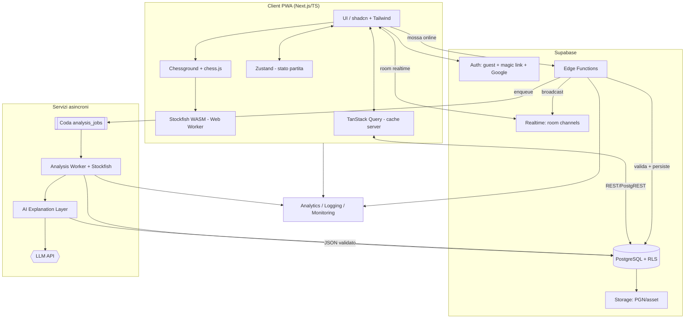
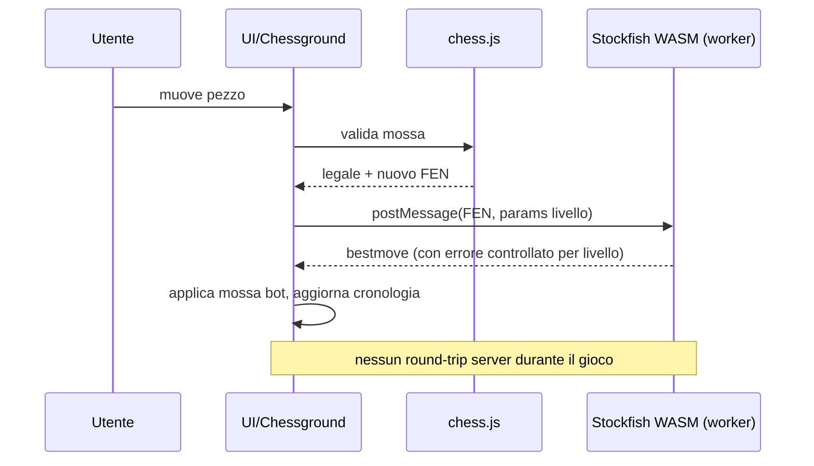
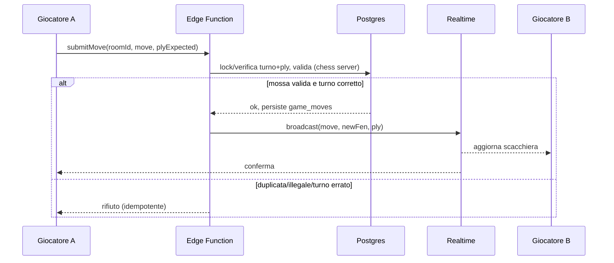
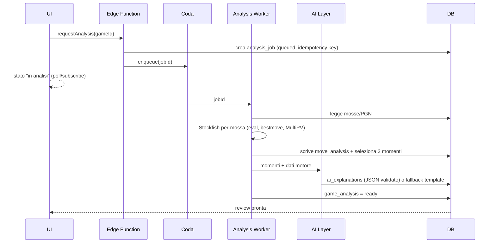

# Piano di Sviluppo — Web App per Imparare e Giocare a Scacchi

> Documento tecnico e di prodotto. **Fase di progettazione**: nessun codice, nessuna dipendenza, nessuna implementazione. Serve a essere revisionato prima di autorizzare lo sviluppo.
>
> Data: 2026-07-13 · Stato: Draft per revisione · Autore: Progettazione tecnica (Architect / Product / UX / TPM)
>
> Nome di lavoro del prodotto: **"Pensa" (working title)** — sostituibile in fase di branding (vedi §36 e §37).

---

## 1. Executive summary

Si propone una web app **mobile-first, PWA**, che insegna a giocare a scacchi a principianti e intermedi (400–1400 Elo) attraverso un percorso verticale gamificato, partite contro bot a difficoltà graduata (0–10), partite private via link e — soprattutto — un motore di **feedback educativo** che non si limita a mostrare la mossa migliore ma spiega *perché* e si allinea all'*intenzione* dichiarata dal giocatore.

Il differenziatore centrale è la catena **analisi deterministica (Stockfish) → classificazione educativa proprietaria → spiegazione in linguaggio naturale vincolata ai dati → collegamento con skill profile, missioni e puzzle personalizzati**. Il modello linguistico (LLM) *spiega* ma non *decide* mai la valutazione scacchistica.

**Raccomandazioni tecniche chiave (motivate nel documento):**

- **Frontend:** Next.js (App Router) + TypeScript + Tailwind + shadcn/ui, **Chessground** per la scacchiera, **chess.js** per le regole, Zustand (stato UI/partita) + TanStack Query (dati server), PWA.
- **Backend/DB/Realtime/Auth:** **Supabase** (PostgreSQL + Auth + Realtime + Edge Functions + Storage) per minimizzare time-to-market e costo iniziale, con RLS come perno di sicurezza.
- **Motore in-game:** **Stockfish WASM** in un **Web Worker** lato client per il gioco vs bot e l'hint locale.
- **Motore di analisi post-partita:** **Stockfish server-side** in un **worker/servizio dedicato** (container su Cloud Run o servizio Node separato) con **coda asincrona**, per determinismo, controllo costi e indipendenza dalla potenza del telefono.
- **AI:** un LLM via API con **output JSON strutturato e validato**, prompt versionati, caching aggressivo, budget cap. L'LLM riceve solo dati già calcolati dal motore.

**Scope MVP** (dettaglio §6): home + onboarding leggero, scacchiera completa, bot (5 livelli iniziali dei previsti 11), modalità locale "passa il dispositivo", partita privata via link in realtime, salvataggio/storico, analisi post-partita con **3 momenti educativi**, spiegazione semplice, replay dell'errore, **domanda sull'intenzione post-partita**, skill profile base, missioni base, 15–20 lezioni content-driven, XP, guest mode + auth leggera.

**Rischi principali:** peso/latenza di Stockfish su mobile, costi di analisi e AI a volume, rischio di spiegazioni AI errate (allucinazioni), realismo dei bot ai livelli bassi, e — trasversale — il rischio di **scope eccessivo**. Mitigazioni in §31.

**Prossimo passo consigliato (§38):** approvare Assunzioni (§5) e Scope MVP (§6), rispondere alle 6 domande bloccanti (§37), poi avviare **Fase 0 (discovery/spike tecnici)**.

---

## 2. Visione del prodotto

> **"Non mostrare solo la mossa migliore: insegna a pensare meglio."**

La maggior parte delle piattaforme scacchistiche tratta l'utente come un motore da correggere: mostra una valutazione numerica, una freccia sulla mossa migliore, un'etichetta ("Blunder"). Il principiante impara *cosa* era meglio ma non *perché*, e soprattutto non capisce *dove ha sbagliato il proprio ragionamento*.

La visione è un prodotto che chiude il ciclo **intenzione → azione → conseguenza → correzione → esercizio**:

1. Il giocatore gioca (contro bot, amico o in locale).
2. Dopo la partita, per pochi momenti realmente istruttivi, l'app chiede *cosa voleva ottenere*.
3. Il motore calcola in modo deterministico cosa è successo davvero.
4. L'app confronta intenzione, mossa e conseguenza, e spiega la discrepanza in linguaggio semplice.
5. L'errore diventa un puzzle e alimenta il profilo competenze.
6. Le missioni successive attaccano le debolezze reali.

Il motore scacchistico è infrastruttura, non protagonista: l'esperienza è guidata, chiara, incoraggiante e gamificata, ma ogni ricompensa è agganciata a un **miglioramento verificabile**, non al tempo speso.

---

## 3. Proposta di valore

| Per chi | Problema oggi | Cosa offriamo |
|---|---|---|
| Principiante assoluto | Le piattaforme mature assumono conoscenze; l'analisi è criptica | Percorso verticale dal movimento dei pezzi, linguaggio senza gergo |
| Amatoriale 400–1400 | Sa di sbagliare ma non capisce *perché* | Spiegazioni collegate ai dati del motore + confronto con la propria intenzione |
| Chi trova Chess.com/Lichess troppo complessi | Sovraccarico di feature e metriche | UI pulita, mobile-first, pochi feedback ma utili |
| Genitori/insegnanti (secondario) | Servono strumenti guidati per insegnare | Percorso a capitoli, contenuti content-driven, missioni |
| Amici | Vogliono giocare insieme senza attrito | Partita privata via link/QR, senza registrazione obbligatoria |

**Ciò che ci distingue e che è difficile da copiare:** il livello *intenzione → conseguenza* e la trasformazione degli errori reali in curriculum personalizzato. È un fossato basato su prodotto+dati, non su una singola tecnologia.

**Ciò che deliberatamente NON siamo:** una copia di Chess.com. Niente matchmaking pubblico, ranking globale, tornei o social nell'MVP.

---

## 4. Target e casi d'uso

**Target primario:** neofiti, principianti assoluti, amatoriali ~400–1400 Elo, utenti che trovano le piattaforme esistenti troppo complesse, chi vuole capire gli errori senza analisi tecniche difficili, chi preferisce un percorso guidato e gamificato.

**Target secondario:** genitori/insegnanti/educatori, intermedi che vogliono correggere errori ricorrenti, gruppi di amici.

**Casi d'uso rappresentativi (con user journey completi in §8):**

- UC1 — *Curioso*: apre l'app senza account, fa 2 lezioni introduttive, gioca una partita vs bot livello 1, vede una spiegazione, decide di registrarsi per salvare i progressi.
- UC2 — *Amici*: uno crea una partita privata, condivide il link/QR, giocano in realtime, salvano e rivedono i 3 momenti chiave.
- UC3 — *Migliorare*: utente registrato completa la partita vs bot, risponde alla domanda sull'intenzione, riceve 3 puzzle dai propri errori, la missione della settimana diventa "arrocca entro la 10ª mossa".
- UC4 — *Genitore/figlio*: modalità locale "passa il dispositivo" su un tablet.
- UC5 — *Ripasso*: apre lo storico, filtra le partite con "pezzo lasciato in presa", rigioca gli errori.

---

## 5. Assunzioni

Dove manca un'informazione, si esplicita l'assunzione, si sceglie un default ragionevole e si prosegue. Le assunzioni bloccanti diventano domande in §37.

| # | Assunzione (default scelto) | Impatto se errata |
|---|---|---|
| A1 | **Lingua iniziale: Italiano**, con architettura i18n pronta (chiavi di traduzione) per aggiungere EN presto | Contenuti lezioni e prompt AI vanno localizzati; ritocco, non riscrittura |
| A2 | **Piattaforma iniziale: Web PWA** (no app native nell'MVP) | Le native sono post-MVP; nessun blocco |
| A3 | **Account facoltativo**; guest-first, registrazione solo per persistere | Se servisse account obbligatorio, cambia onboarding e RLS |
| A4 | **Uso da parte di minori possibile ma non target primario**; assumiamo utenti ≥13 e trattamento dati minimo. Modalità bambini è post-MVP | Se target esplicito <13 → obblighi COPPA/GDPR-minori pesanti (vedi §23, §37) |
| A5 | **Monetizzazione non attiva nell'MVP** (freemium ipotizzato in futuro) | Le tabelle `subscriptions` restano stub |
| A6 | **AI provider: un LLM commerciale via API** con JSON strutturato; astratto dietro un'interfaccia per poterlo sostituire | Cambio provider = cambio adapter, non architettura |
| A7 | **Budget infrastrutturale contenuto** in fase iniziale; si privilegiano servizi gestiti e piani generosi | Se budget ampio, si può anticipare Stockfish server dedicato/GPU |
| A8 | **Timer disponibile ma opzionale** (default: no timer per principianti) | UI del clock è comunque necessaria |
| A9 | **Forza massima bot ~ livello di club forte** (non serve super-GM); livello 10 = "molto forte" ma con budget di calcolo limitato | Se serve massima forza, cresce costo/latenza |
| A10 | **Analisi post-partita, non live**, nell'MVP | Analisi live sarebbe molto più costosa/complessa |
| A11 | **Nessun requisito offline completo** nell'MVP (PWA con caching statico sì; gioco offline vs bot possibile perché il motore è client-side) | Offline totale (sync partite) è post-MVP |
| A12 | **Team piccolo** (1–3 sviluppatori); la roadmap privilegia servizi gestiti e riduzione di superficie operativa | Con team grande si può parallelizzare di più |

---

## 6. Scope MVP

**Principio guida:** l'MVP deve dimostrare il *valore centrale* (imparare a pensare meglio) con il minor numero di parti mobili. Ogni feature è tenuta solo se serve a quel valore o al loop base di gioco.

### Incluso nell'MVP

| Area | Contenuto MVP | Semplificazioni rispetto alla visione |
|---|---|---|
| Home | 5 entry point (Impara, Bot, Amico, Analizza, Continua) | — |
| Onboarding | Livello percepito + skip test; test iniziale **breve (3–5 posizioni)** opzionale | Test corto, no calibrazione Elo fine |
| Scacchiera | Regole complete (arrocco, en passant, promozione, stallo, ripetizione, 50 mosse, materiale insufficiente), drag&drop + tap-to-move, ultima mossa, mosse legali evidenziate, cronologia, PGN/FEN, undo dove consentito | — |
| Bot | Stockfish WASM, **5 livelli** (mappati su 0/2/4/6/8 della scala finale) | Personalità dei bot: **escluse** |
| Modalità locale | "Passa il dispositivo", rotazione scacchiera opzionale | — |
| Partita privata | Creazione room, colore/casuale, timer opzionale, link + QR, ingresso guest, realtime, riconnessione breve, salvataggio finale | No lobby, no matchmaking |
| Persistenza/Storico | Salvataggio partite, elenco con filtri base, apertura review, export PGN | Ricerca full-text ridotta |
| Analisi | Stockfish server-side async, valutazione per mossa, **selezione di 3 momenti educativi**, best move, replay dalla posizione | Non tutte le 14 categorie: sottoinsieme (vedi §15) |
| Spiegazione AI | Spiegazione **semplice** dei 3 momenti, JSON validato, fallback template | Q&A libero sulla posizione: **ridotto/escluso** |
| Intenzione | Domanda **post-partita** sui momenti chiave, set di intenzioni predefinite + "non lo so" | Domanda in-game, input vocale: esclusi |
| Skill profile | **Base**: 6–8 competenze aggregate, score interpretabile con confidenza | Mappa completa 17 competenze: parziale |
| Missioni | **Base**: 3–5 regole derivate da debolezze | Generazione avanzata/cooldown sofisticato: ridotti |
| Lezioni | **15–20 lezioni** content-driven (Cap. 1–3 principalmente) | Cap. 4–6 parziali o post-MVP |
| Puzzle da partite | Generazione da errori con criteri base | Volume limitato |
| Gamification | XP, livelli, streak semplice, progress bar, badge minimi | Sblocchi estetici, sfide: post-MVP |
| Auth | Guest + magic link/email; conversione guest→registrato | Google login: Should (facile da aggiungere) |
| Assistente educativo | Spiegazione dei momenti (non chat aperta) | Chat contestuale: post-MVP |

### Fuori dal loop di valore → escluso (dettaglio §7)

---

## 7. Funzionalità escluse dall'MVP

Escluse esplicitamente (con fase consigliata):

- Personalità dei bot (aggressivo/difensivo/…): **V1/V2**.
- Maia Chess e sistema ibrido Maia+Stockfish: **V2** (rischio integrazione, §31).
- Coach vocale, input vocale dell'intenzione: **V2+**.
- Bot gemello / "gioca contro te stesso di un mese fa" / analisi dello stile: **V2+**.
- Report settimanale automatico: **V1** (facile, ma non centrale).
- Modalità insegnante, classi, profili bambini: **V2** (implica requisiti privacy minori, §23).
- Scansione scacchiera fisica (OCR/CV): **V3** (alta difficoltà).
- Import da Chess.com/Lichess: **V1/V2** (alto valore, media difficoltà).
- Riconoscimento apertura (nome ECO): **V1** (basso costo, buon valore).
- Social, classifiche, tornei, multiplayer pubblico, matchmaking: **V2+** (fuori dalla tesi di prodotto).
- App mobile nativa, offline completo con sync: **V2+**.
- Q&A libero in chat con l'assistente: **V1** (dopo aver irrigidito i vincoli anti-allucinazione).
- Analisi live durante la partita: **V2** (costo/latenza).

---

## 8. User journey principali

Notazione: `[schermata]`, `→` transizione, `{dato}`.

### J1 — Prima esperienza guest (attivazione)
`[Splash/Home]` → scelta **Impara** → `[Onboarding: "Sai già giocare?"]` {livello_percepito} → (skip test) → `[Lezione 1.1: come si muove il pedone]` interattiva → completamento {xp+, lesson_attempt} → CTA "Prova una partita" → `[Bot livello 1]` → fine partita → `[Analisi: 3 momenti]` → primo "aha" → CTA "Salva i progressi" → `[Auth magic link]` → conversione guest→user (§ flusso guest conversion).

**Tempo alla prima esperienza di valore (TTFV) target:** < 3 minuti dal primo tap.

### J2 — Partita privata con un amico
`[Home]` → **Gioca con un amico** → `[Crea room]` {colore, timer?} → genera `link + QR` → condivide → amico apre link → `[Join room senza account]` {guest_session} → realtime play → disconnessione breve di uno → riconnessione (stato ripristinato) → fine → `[Salva partita?]` → `[Review]`.

### J3 — Loop di miglioramento (utente registrato)
Fine partita vs bot → `[Intenzione]` su 1–3 momenti {player_intention} → `[Analisi + spiegazione]` → generazione `puzzles` dagli errori → aggiornamento `user_skills` (+evidence) → `[Missione aggiornata]` → next session parte da "Continua il tuo percorso".

### J4 — Modalità locale (passa il dispositivo)
`[Home]` → **Gioca con un amico → sullo stesso dispositivo** → `[Setup: nomi, rotazione?]` → gioco a turni, scacchiera ruota → fine → salvataggio opzionale.

### J5 — Analizza una partita esistente
`[Home]` → **Analizza** → incolla PGN o scegli da storico → job di analisi (async) → notifica "analisi pronta" → `[Review]`.

Diagrammi di sequenza dei flussi critici in §10 e nelle sezioni tematiche.

---

## 9. Architettura proposta

### Principi architetturali

1. **Determinismo scacchistico separato dalla narrazione AI.** Il motore produce numeri; l'AI produce testo *a partire da* quei numeri. Confine netto e validato.
2. **Client capace, server autorevole.** Il client fa girare Stockfish per il gioco (latenza zero, costo zero), ma il server valida le mosse nelle partite online e possiede lo stato autorevole delle room.
3. **Content-driven.** Lezioni, missioni, definizioni skill e prompt sono *dati versionati*, non codice: si aggiornano senza deploy applicativo.
4. **Async per il costoso.** L'analisi profonda e le chiamate AI passano da una coda con job idempotenti, cache e budget cap.
5. **Guest-first.** Ogni entità di dominio deve poter appartenere a una `guest_session` e migrare a un `user`.

### Componenti logiche

- **Client PWA (Next.js)**: UI, scacchiera, Stockfish-WASM worker (gioco/hint), state manager, cache dati.
- **Supabase Postgres**: sorgente di verità per utenti, partite, contenuti, skill, gamification.
- **Supabase Auth**: guest (anonimo) + magic link/email + (Should) Google.
- **Supabase Realtime**: canali per le room delle partite private (broadcast + presence) e/o Postgres changes.
- **Edge Functions (Supabase)**: validazione mosse online, creazione/gestione room, enqueue job, guest conversion, endpoint AI-proxy.
- **Analysis Worker (servizio separato)**: container Node + Stockfish nativo/WASM, consuma la coda `analysis_jobs`, scrive `game_analysis`/`move_analysis`.
- **AI Explanation Layer**: modulo (in Edge Function o nel worker) che costruisce il prompt dai dati del motore, chiama l'LLM, valida il JSON, applica fallback e caching (`ai_explanations`).
- **Storage**: PGN, eventuali asset, esportazioni.
- **Analytics + Logging + Monitoring**: eventi di prodotto, log strutturati, error tracking, uptime.

### Confini e responsabilità (chi possiede cosa)

| Preoccupazione | Owner | Note |
|---|---|---|
| Regole/legalità mosse (client) | chess.js | UX immediata |
| Legalità autorevole (online) | Edge Function + chess (server) | Anti-cheat base, anti-desync |
| Forza bot | Stockfish WASM (client) | Parametri per livello |
| Valutazioni/analisi | Stockfish server (worker) | Deterministico, riproducibile |
| Testo esplicativo | LLM (validato) | Mai valutazioni numeriche proprie |
| Stato room realtime | Supabase Realtime + DB | DB autorevole, realtime per notifica |
| Contenuti (lezioni/missioni/prompt) | DB/JSON versionati | Nessun deploy per aggiornare |

---

## 10. Diagramma architetturale



### Sequenza — Partita vs bot (client-only)


### Sequenza — Partita privata (server-autoritativo)


### Sequenza — Analisi post-partita + spiegazione


---

## 11. Stack raccomandato

Per ogni scelta: **raccomandazione + motivazione**; alternative e trade-off completi in §12.

### Frontend
- **Next.js (App Router) + TypeScript** — SSR/ISR per pagine di contenuto e landing, ottime PWA, ecosistema React maturo, deploy semplice su Vercel. TS obbligatorio per un dominio con molte invarianti (stati partita, tipi mosse).
- **Tailwind CSS + shadcn/ui** — velocità di UI consistente, componenti accessibili di base, nessun lock-in (shadcn è codice copiato, non dipendenza runtime).
- **Chessground** (raccomandato) vs React Chessboard (alternativa) — vedi §13/§12. Chessground è la libreria di board di Lichess: performante, accessibile, ottimo su mobile (drag + tap), gestione frecce/evidenziazioni; ma è imperativa (va incapsulata in un wrapper React). React Chessboard è più "React-native" e rapida da integrare ma meno ricca. **Raccomandazione: Chessground** con wrapper, per qualità mobile e feature (frecce/annotazioni utili all'analisi).
- **chess.js** — regole/validazione/PGN/FEN lato client. Standard de-facto, ben testato.
- **Zustand** (stato partita/UI locale) + **TanStack Query** (dati server, cache, retry) — separazione netta tra stato effimero e stato remoto.
- **PWA** (manifest + service worker) — installabilità, caching statico, esperienza app-like. (Attenzione: SW e WASM worker vanno orchestrati con cura, §24.)

### Backend / dati
- **Supabase** come piattaforma: **Postgres + Auth + Realtime + Edge Functions + Storage**. Motivazione: un solo fornitore copre 5 esigenze, RLS dà sicurezza dichiarativa vicino ai dati, guest anonimi supportati, costo iniziale basso, ottima DX. Rischio lock-in mitigato dal fatto che il cuore è **Postgres standard** (portabile).
- **Edge Functions (Deno)** per logica autorevole (validazione mosse online, room, enqueue, guest-conversion, AI-proxy).
- **Servizio separato per l'Analysis Worker** (Node + Stockfish) — *non* dentro le Edge Functions, perché l'analisi è CPU-bound e lunga: va su un runtime con più CPU/tempo (Cloud Run container o piccolo servizio dedicato) e una coda.

### Motore
- **In-game:** Stockfish **WASM** in Web Worker (single-thread o multi-thread se COOP/COEP disponibili).
- **Analisi:** Stockfish **nativo server-side** nel worker per throughput/determinismo.

### AI
- **Un LLM via API** dietro un **adapter** (provider-agnostico), **output JSON schema-validated**, **prompt versionati** (`prompt_versions`), **cache** (`ai_explanations`), **budget/rate cap**, moderazione basica.

### Hosting
- **Vercel** (frontend), **Supabase** (DB/Auth/Realtime/Functions/Storage), **Cloud Run o equivalente** (Analysis Worker in container). Dominio + email transazionale (magic link) via provider gestito.

---

## 12. Alternative tecniche considerate

Legenda: ✅ pro · ⚠️ contro · $ costo · 🔒 lock-in.

### Board UI — Chessground vs React Chessboard vs custom
- **Chessground** ✅ performance mobile, drag+tap, frecce/annotazioni, usata da Lichess ⚠️ imperativa (wrapper), curva iniziale 🔒 basso (GPL/estendibile — verificare licenza §32). **Scelta.**
- **React Chessboard** ✅ integrazione React immediata ⚠️ meno feature per analisi, animazioni/perf inferiori su liste lunghe. **Alternativa** se serve velocità di prototipo.
- **Board custom** ⚠️ costo enorme, riscoperta di bug risolti. **Scartata.**

### Logica scacchi — chess.js vs alternative
- **chess.js** ✅ standard, testato, PGN/FEN ⚠️ perf su analisi massiva (usare comunque il motore per l'eval). **Scelta.**
- Motori alternativi JS (es. varianti tipizzate) — marginale beneficio, meno ecosistema. **Non ora.**

### Realtime — Supabase Realtime vs WebSocket custom vs Firebase vs Ably/Pusher
- **Supabase Realtime** ✅ già nello stack, broadcast+presence+postgres changes, RLS 🔒 medio ⚠️ pattern di autorevolezza vanno progettati (la mossa passa da Edge Function, non da write diretta client). **Scelta MVP.**
- **WebSocket custom (Node)** ✅ controllo totale, stato in memoria per room ⚠️ va gestito scaling/sticky/reconnect/infra $ più ops. **Alternativa** se il realtime Supabase mostrasse limiti.
- **Firebase (RTDB/Firestore)** ✅ realtime maturo, presence ⚠️ due ecosistemi (auth/DB diversi da Postgres), modello dati NoSQL non ideale per il resto 🔒 alto. **Scartata** (frammenterebbe lo stack).
- **Ably/Pusher** ✅ realtime robusto gestito $ costo dedicato 🔒 medio. **Fallback** se serve realtime premium.

### Backend piattaforma — Supabase vs Firebase vs backend custom (Node) + Postgres gestito
- **Supabase** ✅ tutto-in-uno, Postgres, RLS, DX ⚠️ Edge Functions con limiti di durata/CPU 🔒 medio (ma Postgres portabile). **Scelta.**
- **Firebase** ✅ realtime/auth ⚠️ NoSQL, query relazionali scomode per skill/analisi 🔒 alto. **Scartata.**
- **Backend custom (NestJS/Express) + Postgres gestito (Neon/RDS)** ✅ massimo controllo ⚠️ molto più codice/ops, rallenta MVP. **Post-MVP** se la complessità cresce.

### Motore analisi — WASM client vs Stockfish server vs servizio esterno
- **Client WASM** per l'analisi ⚠️ dipende dal device (telefoni deboli), non deterministico tra utenti, scarica lavoro sul cliente ma UX incoerente. **Ok per hint, no per analisi ufficiale.**
- **Stockfish server (container)** ✅ deterministico, controllabile, indipendente dal device ⚠️ costo CPU, serve coda. **Scelta per analisi.**
- **Servizio esterno di analisi** ⚠️ costo/opacità/licenza. **Scartata.**

### AI — un provider vs multi-provider vs modello self-hosted
- **Single provider dietro adapter** ✅ semplicità, qualità JSON ⚠️ dipendenza esterna $ variabile. **Scelta**, con adapter per sostituibilità.
- **Self-hosted (modello aperto)** ✅ costo marginale/controllo ⚠️ infra/GPU, qualità JSON/istruzioni inferiore. **Valutare a volume** (post-MVP).

### Hosting worker — Cloud Run vs Fly.io vs Render vs VPS
- Tutti validi; **Cloud Run/Render** per scaling-to-zero (paghi l'uso), buon fit per carico a burst dell'analisi. Decisione operativa non bloccante; scegliere in Fase 0 in base a costi verificati (§33) e regione dati (GDPR).

---

## 13. Motore scacchistico e bot

### 13.1 Regole e stato (client)
`chess.js` gestisce legalità, scacco/matto/stallo, arrocco, en passant, promozione, ripetizione, 50 mosse, materiale insufficiente, PGN/FEN. La UI (Chessground) mostra ultima mossa, mosse legali, orientamento, drag&drop e tap-to-move, undo dove consentito, cronologia. **Invariante:** l'unica fonte di legalità lato client è chess.js; la UI non deve mai applicare una mossa non validata.

### 13.2 Stockfish in-game (WASM, Web Worker)
- Gira in un **Web Worker** dedicato: la UI non si blocca mai (§24).
- **Multi-thread** solo se la pagina è *cross-origin isolated* (header COOP/COEP) — altrimenti fallback single-thread. Da verificare con Vercel/PWA in Fase 0 (spike).
- Comunicazione via protocollo **UCI** su `postMessage`.

### 13.3 Come rendere realistici gli 11 livelli (0–10)

**Problema noto:** limitare Stockfish solo con `Skill Level` basso produce bot che sembrano "forti ma sabotati" (giocano bene e poi buttano un pezzo a caso). Per i livelli bassi serve un giocatore *debole in modo umano*, non *forte con rumore*.

**Strategia stratificata:**

1. **Livelli bassissimi (0–2):** *non* usare la mossa migliore di Stockfish. Usare **MultiPV** per ottenere N mosse candidate legali con relativa eval, poi **campionare** tra di esse con una distribuzione che favorisce mosse mediocri ma non palesemente perdenti in modo casuale; al livello 0 quasi uniforme tra mosse ragionevoli (evitando solo di regalare matto immediato). L'obiettivo è un avversario che *sviluppa lentamente, non punisce, ma non si suicida a caso*.
2. **Livelli intermedi (3–7):** combinare **`Skill Level` UCI** + **limiti di profondità/nodi/tempo** + **iniezione controllata di errori** (con probabilità decrescente col livello) applicata scegliendo occasionalmente la 2ª/3ª mossa MultiPV invece della migliore, con soglia di "gravità" dell'errore che cresce ai livelli bassi. Così il bot *a volte* non vede la tattica, coerentemente con un umano.
3. **Livelli alti (8–10):** `Skill Level` alto/pieno, profondità/tempo crescenti, iniezione errori minima/nulla; il 10 è Stockfish con budget di calcolo generoso ma limitato (per costo e per non essere frustrante). **`UCI_LimitStrength` + `UCI_Elo`** può ancorare la forza a fasce Elo dichiarate per gli intermedi.

**Parametri per livello (bozza da calibrare in Fase 3):**

| Livello | Percezione | Skill Level | Profondità/Tempo | MultiPV / campionamento | Errore iniettato |
|---|---|---|---|---|---|
| 0 | Quasi casuale | n/a | prof. min | MultiPV alto, scelta ~uniforme tra legali non-suicide | massimo |
| 1 | Vede catture evidenti | molto basso | min | favorisce catture ovvie, resto random | alto |
| 2 | Vede minacce immediate | basso | bassa | evita cattura di pezzo appeso proprio | alto |
| 3 | Sviluppa, sbaglia spesso | basso | bassa | preferisce sviluppo | medio-alto |
| 4 | Tattiche semplici | medio-basso | media | vede fork/pin a 1 mossa a volte | medio |
| 5 | Amatoriale equilibrato | medio | media (UCI_Elo ~1000–1100) | — | medio |
| 6 | Punisce errori evidenti | medio | media | coglie pezzi appesi avversari | medio-basso |
| 7 | Piani semplici | medio-alto | media-alta (UCI_Elo ~1300) | — | basso |
| 8 | Giocatore di circolo | alto | alta | — | molto basso |
| 9 | Molto preciso | alto | alta | — | ~nullo |
| 10 | Motore molto forte | pieno | alta (budget limitato) | — | nullo |

**Determinismo/varietà:** un seme per-partita permette ripetibilità in test ma varietà tra partite (evitare che il bot giochi sempre identico).

**MVP:** 5 livelli (0/2/4/6/8 come rappresentanti) per validare la percezione e la pipeline di calibrazione; gli 11 completi arrivano dopo la taratura.

### 13.4 Maia Chess (futuro, V2)
Maia è una rete neurale addestrata a *imitare* mosse umane a specifiche fasce Elo → bot molto più "umani" ai livelli bassi/intermedi. **Complessità:** serve servire una rete neurale (inferenza, infra, peso), integrazione UCI, licenze/dataset (§32). **Piano:** valutare in V2 un **ibrido Maia (mosse umane plausibili) + Stockfish (guardrail anti-blunder catastrofico e per i livelli alti)**. Non nell'MVP: aggiunge una dipendenza infrastrutturale pesante prima di aver validato il valore.

### 13.5 Personalità dei bot (futuro)
Aggressivo/difensivo/tattico/posizionale/amante degli scambi/impulsivo/"usa troppo la donna"/"attacca prima di arroccare": implementabili come **funzioni di bias** sulla selezione MultiPV (pesare mosse che aprono il gioco, che scambiano, che muovono la donna presto, ecc.) o via Maia+bias. **MVP: escluso.** V1/V2: introdurre 2–3 personalità come layer sopra il campionamento MultiPV già presente.

---

## 14. Multiplayer privato

### 14.1 Modello delle room
- **`game_rooms`** con: `id`, `code` (link non enumerabile), stato (`waiting|active|finished|expired`), `time_control`, `creator_session`, colori assegnati, `fen` corrente, `ply`, `turn`, `updated_at`, `expires_at`.
- **Link sicuro:** codice ad alta entropia (es. 128 bit) non sequenziale → non enumerabile (§23). Il link *è* la capability; opzione futura per PIN aggiuntivo.
- **Ownership:** il creatore possiede la room; il secondo giocatore entra come guest o utente. Entrambi legati via `game_players`.

### 14.2 Sincronizzazione e autorevolezza
**Decisione chiave:** le mosse online **non** sono scritte direttamente dal client sul DB. Passano da una **Edge Function** che:
1. verifica identità/appartenenza alla room (RLS + token);
2. verifica **turno** e **ply atteso** (previene mosse duplicate e out-of-order);
3. valida la **legalità** server-side (chess in Deno) contro il `fen` corrente;
4. persiste `game_moves`, aggiorna `fen/ply/turn`;
5. **broadcast** via Realtime agli altri partecipanti.

Il **Realtime** serve a *notificare*, il **DB è autorevole**. Questo previene desync, cheating banale (mosse illegali/di forza) e doppie mosse.

### 14.3 Turni, duplicati, concorrenza
- **Idempotenza:** ogni submitMove porta un `client_move_id`; ritentare la stessa mossa non la applica due volte.
- **Ply expected:** il client dichiara il ply che si aspetta; se non combacia (perché è arrivata prima la mossa dell'altro), rifiuto con stato aggiornato.
- **Lock ottimistico** sulla riga room (`updated_at`/`ply` come guardia) per gestire due submit concorrenti.

### 14.4 Riconnessione
- Alla riapertura, il client richiede lo **snapshot** (fen, cronologia, clock) e si ri-sottoscrive al canale.
- Finestra di grazia (es. breve) prima di considerare abbandono/timeout; presence per mostrare "avversario offline".
- Clock: il tempo trascorso è calcolato **server-side** su timestamp autorevoli, non sul client.

### 14.5 Scadenza e pulizia
- Room `waiting` non riempite scadono (es. dopo N minuti); room `active` inattive scadono con salvataggio dello stato; job di cleanup periodico. `expires_at` + retention (§21).

### 14.6 Guest e salvataggio finale
- Entrambi i giocatori possono essere guest (`guest_sessions`). A fine partita, la partita è salvabile; se un guest si registra, la partita migra (§ guest conversion).

### 14.7 Realtime: raccomandazione
**Supabase Realtime** (broadcast + presence) nell'MVP, con l'autorevolezza in Edge Function come sopra. Motivazione: sta nello stack, RLS coerente, costo iniziale basso, sufficiente per partite 1-a-1 private senza matchmaking. **Fallback documentato:** se emergono limiti (latenza/scala), migrare le room a un servizio WebSocket dedicato (Node stateful) o Ably, mantenendo il DB come sorgente di verità (il confine è già progettato per consentirlo).

---

## 15. Sistema di analisi

### 15.1 Pipeline (deterministica, server-side)
1. **Ingest:** dalla partita (PGN/mosse) o da PGN importato.
2. **Eval per mossa:** Stockfish a profondità/tempo fissi per posizione → `eval` (centipawn o mate score), `best move`, **MultiPV** (2–3 linee), `depth`.
3. **Metriche derivate:** variazione di eval mossa-per-mossa (`cpl` = centipawn loss), materiale, fase (apertura/mediogioco/finale via conteggio pezzi/mosse), pezzi appesi (dal motore/analisi statica), mosse forzanti, sicurezza del re (euristiche verificabili).
4. **Selezione momenti:** ranking dei ply per "valore didattico" (grande swing di eval + categorizzabilità + rilevanza per il livello utente) e scelta dei **top-3** (MVP). Evitare di scommentare rumore.
5. **Classificazione** (proprietaria, §15.3).
6. **Handoff all'AI** solo per la *narrazione* dei momenti selezionati (§16).

**Determinismo:** stessi parametri (profondità/tempo/hash/threads) → stesso risultato. I parametri sono versionati per riproducibilità (`analysis_jobs.engine_params`).

### 15.2 Perché server-side e async
Analisi profonda su 40+ posizioni è troppo pesante/incoerente sul client. Async con coda → UX non bloccante, costo controllato, cache dei risultati.

### 15.3 Classificazione proprietaria (educativa)
Invece di copiare le etichette di Chess.com, si usa una tassonomia **comprensibile e orientata alla causa**, con soglie basate su `cpl`/`mate`/pattern:

| Etichetta educativa | Trigger (deterministico) |
|---|---|
| ⭐ Mossa forte / migliore | mossa = best move o `cpl` ~0 |
| 👍 Buona | `cpl` piccolo |
| 🤔 Imprecisione | `cpl` moderato senza perdita materiale grave |
| ⚠️ Errore | `cpl` alto |
| ❌ Errore grave | `cpl` molto alto / da vinto a perso |
| 🎯 Occasione mancata | esisteva una tattica/matto vincente non giocato |
| 🩸 Pezzo lasciato in presa | pezzo appeso non protetto dopo la mossa |
| 🧩 Tattica mancata | pattern (fork/pin/skewer) disponibile e non colto |
| ♚ Matto mancato | mate score disponibile non realizzato |
| 🏗️ Problema di sviluppo | fase apertura + pezzi non sviluppati/mossa ripetuta |
| 🛡️ Re non sicuro | re non arroccato/esposto in apertura-mediogioco |
| ⚖️ Cambio sfavorevole | scambio che perde valore materiale/posizionale |
| ♟️ Pedone perso | perdita di pedone evitabile |
| ⏳ Errore di finale | fase finale + swing decisivo |

**Regola d'oro:** l'etichetta è **derivata dal motore/euristiche**, mai inventata dall'AI. L'AI riceve l'etichetta e *la spiega*.

### 15.4 Output all'utente
Per ciascuno dei 3 momenti: posizione, mossa giocata vs best move (con freccia), eval prima/dopo (mostrata in modo comprensibile, es. barra o "hai perso il vantaggio"), spiegazione semplice, **replay** dalla posizione, e (se idoneo) generazione di un **puzzle**.

### 15.5 MVP vs oltre
- **MVP:** 3 momenti, sottoinsieme di etichette (best/buona/imprecisione/errore/errore grave + pezzo in presa + occasione mancata), profondità moderata.
- **V1:** più momenti configurabili, riconoscimento apertura (ECO), pattern tattici più ricchi, "accuracy" proprietaria (score educativo, non copia di Chess.com).

---

## 16. Sistema di spiegazione AI

### 16.1 Ruolo e vincoli
L'LLM **spiega**, non valuta. Riceve **solo dati già calcolati** e produce un **JSON strutturato validato** prima di essere mostrato. Non deve: inventare valutazioni, suggerire mosse illegali, contraddire il motore, produrre testi lunghi.

### 16.2 Input (contratto dati minimo verso l'LLM)
```
{
  livello_utente, lingua,
  fen_prima, fen_dopo,
  mossa_giocata (SAN), best_move (SAN), seconda_migliore (SAN),
  eval_prima, eval_dopo, delta_cpl, mate_score?,
  linee_multipv: [ { san_sequence, eval } ],
  fase_partita, materiale, pezzi_appesi[],
  pattern_rilevati[] (es. "fork disponibile su e4"),
  etichetta_educativa, intenzione_dichiarata?, skill_deboli_rilevanti[]
}
```
Niente PGN completo se non necessario (privacy/costi); solo il contesto del momento.

### 16.3 Output (schema JSON validato)
```
{
  "titolo": string (breve),
  "spiegazione": string (<= N caratteri, linguaggio livello utente),
  "perche_era_meglio": string,
  "concetto_chiave": enum(skill_id),
  "semplificato": boolean,   // true = spiegazione volutamente semplificata
  "confidenza": "alta|media|bassa"
}
```
Validazione: schema (tipi/lunghezze), coerenza (il `concetto_chiave` deve appartenere alla tassonomia; nessun riferimento a mosse non presenti nelle linee fornite), **niente numeri di eval inventati** (l'AI non introduce valutazioni sue: se cita un vantaggio, deve mapparlo alle categorie qualitative fornite).

### 16.4 Anti-allucinazione (difese a più livelli)
1. **Grounding:** l'AI riceve i fatti; il prompt vieta di aggiungerne.
2. **Whitelist di mosse:** qualsiasi SAN citato deve essere tra {mossa_giocata, best, seconda, linee MultiPV}; validatore rifiuta il resto.
3. **Fallback template:** se la validazione fallisce (retry incluso), si mostra una **spiegazione template** deterministica basata su etichetta+dati (nessun testo AI). L'utente vede sempre qualcosa di corretto, al massimo più asciutto.
4. **Caching:** `ai_explanations` chiavata su (fen+contesto+prompt_version+lingua+livello) → stesso momento non ri-genera (costo e coerenza).
5. **Prompt versionati** (`prompt_versions`) per audit e rollback.
6. **Budget/rate cap** per utente e globale (§23).

### 16.5 Assistente conversazionale
MVP: **no chat aperta** (troppo rischio/allucinazione). Solo spiegazioni dei momenti. **V1:** Q&A sulla posizione con gli stessi vincoli (grounding + whitelist), risposte brevi, "dichiara quando semplifica".

---

## 17. Intenzione del giocatore (feature differenziante)

### 17.1 Quando chiedere (MVP: post-partita)
Per **non interrompere** il gioco, nell'MVP la domanda arriva **dopo la partita**, solo sui **momenti decisivi** (max 1–3). Non su ogni mossa. In-game è **V2** (rischio di rompere il flow).

### 17.2 Cosa si chiede
"Che cosa volevi ottenere con questa mossa?" con opzioni **predefinite** (tap veloce): attaccare il re, difendere un pezzo, catturare, creare una minaccia, sviluppare, controllare il centro, preparare l'arrocco, evitare una minaccia, semplificare, promuovere, **non lo so**, + campo testo libero (opzionale). Vocale: futuro.

### 17.3 Cosa confronta il sistema
Intenzione dichiarata × mossa giocata × effetto reale (dal motore) × alternativa migliore **coerente con la stessa intenzione**. Esempio target:
> "L'idea di attaccare f7 era valida, ma l'ordine delle mosse era sbagliato: prima completa lo sviluppo e metti al sicuro il re."

Questo richiede: mappare l'intenzione a criteri verificabili (es. "attaccare il re" → esistono mosse che aumentano la pressione sul re?), e cercare tra le linee del motore una mossa che soddisfa l'intenzione *meglio*.

### 17.4 Dati salvati (`player_intentions`)
ply, fen, intenzione_enum, testo_libero?, mossa_giocata, effetto_reale (categoria), alternativa_coerente?, esito ("intenzione buona ma esecuzione errata" / "intenzione rischiosa" / "intenzione allineata al best" / "non interpretabile").

### 17.5 Collegamento con errori e skill
L'intenzione arricchisce la classificazione: es. "impulsività" se dichiara "catturare" su cattura che perde materiale; "re non sicuro" se attacca prima di arroccare. Alimenta `skill_evidence` e la generazione missioni.

### 17.6 Fallback e rischi
- Intenzione "non lo so" o testo non interpretabile → si spiega comunque il momento senza forzare un match (nessuna allucinazione di intenzione).
- Rischio allucinazione: l'AI **non deve inventare** l'intenzione né inferire stati mentali non supportati; deve limitarsi a confrontare l'intenzione *dichiarata* con i fatti. Il testo libero passa sanitizzazione (prompt injection, §23) prima di raggiungere l'LLM.
- Schema prompt e validazioni come in §16 (whitelist mosse, JSON validato, fallback template).

### 17.7 Frequenza (default assunto, §37)
Default: chiedere su **max 1–3 momenti** per partita, e non a ogni partita se l'utente lo disattiva. Troppa insistenza → attrito.

---

## 18. Percorso educativo

### 18.1 Struttura content-driven (nessun deploy per nuove lezioni)
Lezioni/capitoli/step definiti come **dati** (tabelle `chapters`, `lessons`, `lesson_steps`) e/o **file JSON versionati** importati in DB. Il codice interpreta un piccolo insieme di **tipi di step** (schermata_spiegazione, posizione_interattiva, dimostrazione_guidata, esercizio, mini_partita_obiettivo, test_finale). Aggiungere una lezione = aggiungere dati, non codice.

**Modello step (bozza):**
```
lesson_step {
  id, lesson_id, ordine,
  tipo: enum,
  fen?, obiettivo?, mosse_attese?[], suggerimenti?[],
  testo_it, media?, criterio_completamento, xp
}
```
Criteri: `prerequisiti` (altre lezioni), `criterio_completamento` (es. esercizio risolto), `criterio_padronanza` (es. risolto senza aiuti / entro N mosse) → alimenta skill profile.

### 18.2 Capitoli (dalla visione)
1. La scacchiera (coordinate, movimenti, catture, scacco, matto, stallo)
2. Non perdere i pezzi (valore, protezione, attaccanti/difensori, scambi, pezzi sospesi)
3. Tattiche (forchetta, inchiodatura, infilata, doppio, scoperta, deviazione, sovraccarico, matto in 1/2)
4. Apertura (centro, sviluppo, sicurezza del re, arrocco, non ripetere mosse, non uscire con la donna)
5. Strategia (attività, pezzo peggiore, spazio, colonne aperte, case deboli, struttura pedonale, semplificazione)
6. Finali (matto con donna/torre, re e pedone, opposizione, promozione, finali elementari)

### 18.3 MVP contenuti
**15–20 lezioni**, concentrate su **Cap. 1–3** (il cuore per il target 400–1400) + un assaggio di Cap. 4. La produzione dei contenuti è essa stessa **lavoro sostanziale** (non "solo dati"): richiede design didattico, posizioni verificate col motore, e test di comprensione. Rischio contenuti-insufficienti in §31.

### 18.4 Verifica
Ogni posizione/esercizio è **verificata dal motore** in fase di autoring (la soluzione attesa è davvero la migliore) → nessun esercizio "sbagliato".

---

## 19. Skill profile

### 19.1 Filosofia: interpretabile, non falsa precisione
Niente singolo numero magico. Ogni competenza ha uno **score interpretabile** con **confidenza** legata al numero di osservazioni. Poche osservazioni ⇒ bassa confidenza ⇒ lo score si mostra come "in valutazione", non come verità.

### 19.2 Competenze (`skill_definitions`)
Regole base, coordinate, valore pezzi, pezzi protetti, tattiche a 1 mossa, tattiche a 2 mosse, sviluppo, controllo del centro, sicurezza del re, aperture, strategia, finali, gestione del tempo, controllo delle minacce (CCM: scacchi/catture/minacce), calcolo varianti, impulsività, generazione di mosse candidate.

**MVP:** 6–8 competenze più misurabili con i dati disponibili (es. pezzi in presa → "controllo delle minacce"; arrocco tardivo → "sicurezza del re"; mosse impulsive → "impulsività"; tattiche mancate → "tattiche a 1 mossa"; sviluppo).

### 19.3 Modello per competenza (`user_skills` + `skill_evidence`)
```
user_skill { user_id, skill_id, score(0..1 o banda), confidenza, n_osservazioni,
             trend(up|flat|down), last_updated }
skill_evidence { user_skill_id, source(game_move|puzzle|lesson|intention),
                 ref_id, delta, weight, created_at }
```
Aggiornamento **bayesiano/incrementale**: ogni evidenza (errore, esercizio, lezione) sposta lo score con peso; la confidenza cresce col numero di osservazioni. Mostrare **trend** ed **evidenze** ("perché penso che tu abbia questa debolezza": link alle partite).

### 19.4 Uso
Alimenta missioni, selezione puzzle, adattamento del linguaggio dell'AI e "Continua il tuo percorso".

---

## 20. Missioni e gamification

### 20.1 Missioni derivate dalle debolezze reali
Regole (`missions`) attivate quando lo skill profile mostra una debolezza con confidenza sufficiente. Esempi: "arrocca entro la 10ª", "non lasciare pezzi non protetti", "sviluppa entrambi i cavalli", "controlla scacchi-catture-minacce", "non muovere la donna troppo presto", "considera ≥2 mosse candidate", "risolvi 3 errori estratti dalle tue partite".

**Meccanica:** ogni missione ha `criterio_successo` verificabile (misurabile dai dati di partita/puzzle), `difficoltà`, `cooldown` (anti-farming), `ricompensa` (XP/badge), `skill_collegata`. La **generazione** sceglie 1–3 missioni attive per non sovraccaricare. **Anti-farming:** cooldown + requisito che il successo derivi da partite reali, non ripetute artificialmente.

**MVP:** 3–5 missioni basate su segnali affidabili (arrocco, pezzi in presa, sviluppo).

### 20.2 Gamification agganciata al miglioramento
- **XP** (`xp_events`) assegnati per: completare lezioni, correggere errori (risolvere puzzle dai propri sbagli), applicare concetti in partita, riconoscere minacce, spiegare bene una mossa/intenzione.
- **NON** premiare (o premiare poco) il solo numero di partite/vittorie/tempo.
- Livelli, **streak** semplice, **progress bar** per capitolo, **badge** minimi, obiettivi giornalieri leggeri.
- **MVP semplice:** XP + livelli + streak + progress lezioni. Sblocchi estetici, bot sbloccabili, sfide, riepilogo settimanale → V1/V2.

### 20.3 Puzzle dalle partite (`puzzles`, `puzzle_attempts`)
**Criteri di idoneità** (deterministici) per trasformare un errore in puzzle: swing di eval sopra soglia, esistenza di una **soluzione forzante/chiara** verificata dal motore (il puzzle deve avere *una* risposta didatticamente netta, non una posizione ambigua), tema classificabile, fase sensata, e non duplicato di un puzzle esistente dell'utente. Salvati: FEN, colore al tratto, mossa giocata, best move, linea principale, tema, livello, origine (game_id), data, stato, tentativi, suggerimenti, spiegazione.

---

## 21. Schema database

Postgres su Supabase, **RLS ovunque**, `guest_session_id` presente sulle entità di dominio per il guest-first, timestamps standard. Tipi JSON usati con parsimonia per payload flessibili (parametri motore, contenuti step). Di seguito scopo + campi principali + relazioni + note (indici/RLS/retention). *Non è SQL definitivo* ma è abbastanza concreto da guidare l'implementazione.

> Convenzioni: PK `id uuid`; FK esplicite; `created_at/updated_at`; soft-owner via `user_id` **oppure** `guest_session_id` (esattamente uno valorizzato, vincolo CHECK). Indici su FK e su colonne di filtro. RLS: l'utente vede solo le proprie righe (o le room a cui partecipa); i contenuti (lezioni/skill_definitions/missions/bot_profiles/prompt_versions) sono **pubblici in lettura**.

### Identità e guest
- **users** — utenti registrati (gestito da Supabase Auth). Campi: id, email, created_at. RLS: self.
- **profiles** — dati di prodotto dell'utente: livello_percepito, lingua, onboarding_stato, preferenze (timer, animazioni ridotte, suoni), xp_totale, streak. FK→users. RLS: self.
- **guest_sessions** — sessioni anonime: id, device_token, created_at, last_seen, converted_user_id?. Retention: purge dopo N giorni se non convertite. RLS: per token.

### Partite
- **games** — una partita: modalità (bot|private|local|import), colore_utente, risultato, durata, n_mosse, pgn, fen_finale, time_control, opponent (bot_level|guest|user), score_educativo?, stato_analisi. Owner: user/guest. Indici: (owner, created_at). Retention guest: purge con la sessione.
- **game_players** — partecipanti a una partita/room (per private/local): game_id, side(white|black), user_id?/guest_session_id?, nome_display. Indici: (game_id).
- **game_moves** — mosse: game_id, ply, san, uci, fen_dopo, clock?, created_at. Indici: (game_id, ply) unique. Volume alto → candidato a partizionamento futuro per data.
- **game_rooms** — room realtime: code (unique, non enumerabile), stato, time_control, fen, ply, turn, creator, colori, expires_at, updated_at. Indici: code unique, (stato, expires_at). RLS: partecipanti.

### Analisi
- **analysis_jobs** — coda/idempotenza: game_id, stato(queued|running|done|error), engine_params(json), idempotency_key(unique), tentativi, error?, timestamps. Indici: (stato), idempotency_key unique.
- **game_analysis** — risultato a livello partita: game_id, stato, accuracy_educativa?, momenti_selezionati(json refs a move_analysis), engine_version. 1-1 con games.
- **move_analysis** — per mossa: game_id, ply, eval_prima, eval_dopo, cpl, mate?, best_move, second_best, multipv(json), depth, etichetta, pattern(json), is_momento. Indici: (game_id, ply).
- **player_intentions** — §17.4. FK→games, ply. RLS: owner.

### Contenuti educativi (pubblici in lettura)
- **chapters** — id, ordine, titolo, descrizione, prerequisiti.
- **lessons** — chapter_id, ordine, titolo, obiettivi, prerequisiti, xp, criterio_padronanza.
- **lesson_steps** — lesson_id, ordine, tipo, fen?, mosse_attese(json), testo, criterio_completamento, xp.
- **lesson_attempts** — user/guest, lesson_id, step_id?, stato, esito, aiuti_usati, completed_at. Indici: (owner, lesson_id).

### Puzzle
- **puzzles** — fen, colore_tratto, mossa_giocata, best_move, linea(json), tema, livello, origine(game_id?), data, spiegazione. Owner (per puzzle personali) o pubblici (curati). Indici: (owner, tema, livello).
- **puzzle_attempts** — puzzle_id, owner, stato, tentativi, suggerimenti_usati, tempo, created_at.

### Skill e gamification
- **skill_definitions** — id, nome, descrizione, categoria (pubblico).
- **user_skills** — §19.3. Unique (owner, skill_id).
- **skill_evidence** — §19.3. Indici: (user_skill_id, created_at).
- **missions** — definizioni regole (pubblico): id, titolo, criterio(json), difficoltà, cooldown, ricompensa, skill_id.
- **user_missions** — owner, mission_id, stato, progresso(json), assegnata_at, completata_at, cooldown_until. Indici: (owner, stato).
- **achievements** / **user_achievements** — badge e assegnazioni.
- **xp_events** — owner, tipo, xp, ref(json), created_at. Sorgente per xp_totale (materializzabile).

### AI e config
- **bot_profiles** — livello, parametri motore(json), descrizione percepita (pubblico). MVP: 5 righe.
- **ai_explanations** — cache: hash_input(unique), prompt_version, lingua, livello, output(json), created_at. Retention: TTL/rigenerabile.
- **prompt_versions** — id, nome, template, schema_output, attivo, created_at.
- **subscriptions** (futuro) — stub per monetizzazione.

### Note trasversali
- **RLS**: default deny; policy per owner (user_id = auth.uid()) e per partecipazione room; contenuti pubblici in sola lettura; scritture di analisi/AI solo da service role (worker/Edge Function), mai dal client.
- **Indici**: tutte le FK; colonne di filtro dello storico (owner, created_at, modalità, etichette); code room unique.
- **Retention**: dati guest purgati con la sessione (N giorni); `game_moves`/`move_analysis` candidati a partizionamento per data quando il volume cresce; `ai_explanations` rigenerabile.
- **JSON**: usato per multipv, pattern, engine_params, criteri missioni, contenuti step — dove la forma varia; il resto è relazionale per query/integrità.

---

## 22. API e servizi

Interfacce logiche (via PostgREST per CRUD sotto RLS + Edge Functions per logica autorevole). Contratti indicativi:

- **Auth/guest:** `POST /guest-session` (crea guest), `POST /convert-guest` (migra dati guest→user in transazione).
- **Bot game:** nessun endpoint di gioco (client-only); solo `POST /games` per salvare a fine partita.
- **Private room:** `POST /rooms` (crea, ritorna code/QR), `POST /rooms/:code/join`, `POST /rooms/:code/move` (Edge Function autorevole: valida turno/ply/legalità, persiste, broadcast), `GET /rooms/:code/snapshot` (riconnessione), `POST /rooms/:code/resign|draw`.
- **Realtime:** canale per room (broadcast mosse, presence).
- **Analisi:** `POST /analysis` (enqueue idempotente), stato via subscribe/poll su `game_analysis`.
- **AI:** interna al worker/Edge (`explainMoment`) — non esposta liberamente al client; rate-limited.
- **Contenuti:** letti via PostgREST (lezioni/missioni/skill) con cache.
- **Storico/Export:** `GET /games` (filtri), `GET /games/:id/pgn`.

**Principi API:** idempotenza sulle scritture sensibili, validazione input server-side, rate limiting sugli endpoint costosi (AI/analisi/creazione room), errori strutturati.

---

## 23. Sicurezza e privacy

| Rischio | Mitigazione (MVP) |
|---|---|
| Manipolazione client / mosse illegali online | Validazione **server-side** in Edge Function; il client non scrive mosse direttamente; DB autorevole |
| Cheating (motore esterno) | Fuori scope anti-cheat avanzato nell'MVP; **dichiarato come rischio**; le partite private sono tra amici (basso incentivo). Base: validazione legalità, no forza imposta lato client |
| Room hijacking | Appartenenza verificata (RLS + token), code ad alta entropia, ownership esplicita |
| Enumerazione link | Code non sequenziali ≥128 bit; opzione PIN futura; rate limit sui join |
| Mosse duplicate/replay | Idempotenza (`client_move_id`) + ply expected + lock ottimistico |
| Rate limiting | Su creazione room, analisi, AI; per IP/utente/guest |
| Abuso API AI / costi | Budget cap globale e per-utente, caching, coda, autenticazione delle chiamate, timeout |
| Protezione credenziali | Delegato a Supabase Auth (magic link riduce password); niente segreti nel client |
| RLS | Default-deny, policy per owner e partecipazione; scritture analisi/AI solo service role |
| Privacy / GDPR | Minimizzazione dati; export dati utente; **cancellazione account** (cascade + purge guest); base legale e informativa; region dati EU (verificare in Fase 0) |
| Dati dei minori | **Aperta (§37):** se target <13 → obblighi rafforzati (consenso genitori, no profiling aggressivo). Default assunto ≥13; modalità bambini rimandata |
| Prompt injection (testo libero intenzione / import) | Sanitizzazione input, separazione dati/istruzioni nel prompt, whitelist output, il testo utente è *dato* non *istruzione* |
| Audit log | Log strutturato di azioni sensibili (creazione room, submitMove rifiutate, job AI/analisi) |
| Protezione endpoint | Auth + RLS + rate limit + validazione schema |
| Cost control | Cap e alert su AI/analisi (§33), scaling-to-zero worker |

**Nota:** non si progetta anti-cheat avanzato per l'MVP (dichiarato). Il rischio è accettato dato il contesto (partite private tra amici, target educativo).

---

## 24. Performance

- **UI mai bloccante durante Stockfish:** motore **sempre** in Web Worker; la UI comunica via messaggi. Nessun calcolo pesante sul main thread.
- **Cross-origin isolation** (COOP/COEP) per Stockfish multi-thread: da verificare con Vercel + service worker in Fase 0; fallback single-thread garantito.
- **Bundle:** code splitting, lazy load del motore e delle viste pesanti (analisi/review), Stockfish caricato on-demand (non nella home). Target: home leggera, TTI mobile basso.
- **Analisi progressiva:** mostrare i momenti man mano che pronti; profondità/tempo limitati e configurabili; server-side per non gravare sul device.
- **Telefoni deboli:** hint/bot a profondità ridotta; l'analisi ufficiale è server-side (non dipende dal device).
- **Caching:** contenuti (lezioni/missioni) e `ai_explanations`; TanStack Query per dati server; SW per asset statici.
- **Memory:** terminare il worker Stockfish quando non serve; evitare leak nelle liste mosse lunghe (virtualizzazione se necessario).
- **Realtime:** payload mossa minimale (san/uci/fen/ply), non l'intera partita a ogni update.
- **Target (indicativi, da confermare in Fase 0 con misure reali):** home interattiva rapidamente su mobile mid-range; nessun freeze percettibile durante hint/analisi; riconnessione room entro pochi secondi.

---

## 25. Accessibilità

- **Tastiera:** navigazione completa; mosse via tastiera (selezione casa/pezzo) oltre a drag&drop.
- **Screen reader:** annunci delle mosse in notazione comprensibile; ARIA su scacchiera e controlli; modalità coordinate.
- **Contrasto e temi:** rispettare contrasto AA; tema chiaro/scuro; scacchiere ad alto contrasto.
- **Motion:** rispettare `prefers-reduced-motion` (animazioni ridotte).
- **Audio:** feedback sonoro **opzionale** (mossa/cattura/scacco), disattivabile.
- **Touch:** target ≥ dimensioni minime; tap-to-move con evidenziazione mosse legali; portrait mobile prioritario, tablet landscape, desktop.
- **Notazione comprensibile:** per principianti, opzione "linguaggio semplice" oltre alla SAN.
- **Stati UI espliciti:** loading, empty, error, **reconnect**, "analisi in corso", "in attesa dell'avversario". Nessuno stato "muto".
- **Tutorial contestuali:** suggerimenti leggeri, non modali invasivi.

---

## 26. Analytics

**Eventi (bozza):** onboarding_started/completed, initial_test_started/completed/skipped, first_game_started, game_completed, game_abandoned, review_opened, review_completed, error_replayed, intention_answered, mission_assigned/completed, puzzle_started/completed, lesson_started/completed, room_created, room_shared, room_second_player_joined, signup, guest_converted, return_d1/d7/d30.

**Metriche principali:**
- **Activation:** % che raggiunge la prima esperienza di valore (prima lezione completata o prima review vista); **TTFV**.
- **Retention:** D1/D7/D30.
- **Completion:** lesson completion, game completion, review completion, mission completion, puzzle completion.
- **Improvement (nord-stella di prodotto):** riduzione di errori ripetuti / crescita score competenze nel tempo. È la metrica che valida la tesi "aiutiamo a migliorare".

**Implementazione:** un layer di tracking astratto (adapter) per non legarsi a un provider; rispetto privacy/consenso (§23); niente PII negli eventi.

---

## 27. Strategia di test

| Livello | Cosa | Esempi/casi critici |
|---|---|---|
| Unit | Logica pura | Mappatura parametri bot per livello; classificatore etichette (soglie cpl); calcolo skill update; validatore JSON AI; selezione 3 momenti |
| Unit scacchi | **Mosse speciali** | Arrocco (diritti, sotto scacco, case attaccate), en passant, promozione (tutte le figure), stallo vs matto, 50 mosse, ripetizione, materiale insufficiente |
| Integration | Edge Functions | submitMove: turno errato, ply errato, mossa illegale, duplicata (idempotenza), room piena/scaduta |
| Realtime | Sync/concorrenza | Due submit concorrenti, ordine mosse, riconnessione con snapshot, presence, avversario offline |
| E2E | Flussi utente | Onboarding→prima partita→review; crea room→join guest→gioca→salva; analizza PGN→review; guest→conversione |
| Motore | Determinismo analisi | Stessi parametri → stesso output; regressione su posizioni note; bot: distribuzione mosse plausibile per livello (test statistici, non singola mossa) |
| AI output | Contratto | Schema valido, whitelist mosse rispettata, fallback template quando l'AI fallisce, nessuna eval inventata |
| Accessibilità | a11y | Navigazione tastiera, ARIA, contrasto, reduced-motion |
| Mobile/perf | Device reali | Nessun freeze durante hint/analisi; bundle budget; mid-range Android |
| Sicurezza | RLS/abuso | Un utente non legge dati altrui; rate limit; enumerazione code; prompt injection nel testo intenzione |
| Regression | Suite CI | Golden games/PGN, snapshot classificazione |

**Casi critici da non fallire mai:** legalità mosse speciali, autorevolezza online (nessuna mossa illegale accettata), RLS (isolamento dati), AI che non inventa valutazioni, riconnessione senza perdita di stato.

---

## 28. Roadmap di sviluppo

> Nessuna stima temporale arbitraria. Le fasi sono ordinate per dipendenze e valore. Ogni fase ha **criteri di accettazione verificabili**. La granularità è pensata per diventare issue tecniche.

### Fase 0 — Discovery e decisioni tecniche
- **Obiettivo:** eliminare l'incertezza tecnica ad alto rischio prima di costruire.
- **Attività:** spike Stockfish WASM (single vs multi-thread, COOP/COEP su Vercel+PWA, peso/latenza su mobile mid-range); spike Stockfish server-side + coda (throughput, costo per partita analizzata); spike Supabase Realtime autorevole (Edge Function submitMove + broadcast, latenza); scelta hosting worker (costi verificati §33); scelta AI provider + test JSON strutturato + costo per spiegazione; verifica **licenze** (§32); decisione region dati (GDPR).
- **DB/Backend/Frontend:** nessuna feature; solo prototipi throwaway isolati.
- **Rischi:** COOP/COEP non abilitabile con la PWA (mitig.: fallback single-thread + analisi server).
- **Test:** benchmark riproducibili (latenza motore, costo analisi/AI).
- **Criterio di completamento:** documento di decisioni con numeri reali; tutte le §37 con risposta o default confermato; go/no-go sullo stack.
- **Non incluso:** qualsiasi codice di prodotto.
- **Output:** report spike + ADR (Architecture Decision Records) + stime costi aggiornate.

### Fase 1 — Fondazioni progetto
- **Obiettivo:** scheletro applicativo, CI, ambienti.
- **Attività FE:** Next.js+TS+Tailwind+shadcn, design system base, i18n, PWA scaffold, routing schermate vuote.
- **BE/DB:** progetto Supabase, migrazioni iniziali (users/profiles/guest_sessions), **RLS di base**, ambienti staging/prod, secrets management.
- **Dipendenze:** Fase 0.
- **Rischi:** setup PWA/SW vs WASM (annotato per Fase 2).
- **Test:** CI verde (lint/type/unit vuoti), deploy staging.
- **Criterio:** app deployata in staging, guest-session creabile, RLS attiva.
- **Non incluso:** logica di gioco.
- **Output:** repo strutturato, pipeline CI/CD, ambienti.

### Fase 2 — Motore e scacchiera
- **Obiettivo:** scacchiera giocabile completa (client), regole ufficiali.
- **FE:** integrazione Chessground+chess.js (wrapper), drag&drop + tap-to-move, evidenziazioni, cronologia, PGN/FEN, undo, orientamento, timer opzionale UI, **modalità locale "passa il dispositivo"**.
- **DB/BE:** `games`/`game_moves` (salvataggio locale/finale).
- **Rischi:** mosse speciali edge cases.
- **Test:** suite mosse speciali (§27) verde; E2E "gioca in locale e salva".
- **Criterio:** partita locale completa con tutte le regole, salvataggio PGN.
- **Non incluso:** bot, online, analisi.
- **Output:** scacchiera di riferimento riusabile ovunque.

### Fase 3 — Bot
- **Obiettivo:** avversario con livelli percepibili.
- **FE:** Stockfish WASM in worker, UI selezione livello con descrizioni percepite, hint opzionale.
- **BE/DB:** `bot_profiles` (parametri per livello).
- **Attività chiave:** **calibrazione** (MultiPV + campionamento + skill/UCI_Elo + errore iniettato) per evitare "forti ma sabotati".
- **Rischi:** bot poco realistici ai livelli bassi (mitig.: test statistici su distribuzione mosse, iterazione parametri).
- **Test:** distribuzione mosse plausibile per livello; nessun blocco UI; determinismo con seed.
- **Criterio:** **5 livelli** giocabili e percepiti coerenti da tester; partita vs bot salvabile.
- **Non incluso:** personalità, Maia, 11 livelli completi.
- **Output:** modalità "Gioca contro un bot" MVP.

### Fase 4 — Partite private
- **Obiettivo:** giocare con un amico via link in realtime, in modo autorevole.
- **FE:** crea room (colore/timer), link+QR, join guest, board realtime, stati (attesa/riconnessione/offline), resign/draw.
- **BE:** Edge Functions (create/join/**move autorevole**/snapshot), Supabase Realtime, idempotenza, ply-check, scadenza room, cleanup.
- **DB:** `game_rooms`, `game_players`.
- **Rischi:** realtime instabile/desync/concorrenza (mitig.: autorevolezza server + idempotenza + snapshot).
- **Test:** integration/realtime/concorrenza (§27); riconnessione senza perdita stato.
- **Criterio:** due dispositivi giocano una partita completa via link, con riconnessione e salvataggio finale; nessuna mossa illegale/duplicata accettata.
- **Non incluso:** lobby, matchmaking, spettatori.
- **Output:** modalità "Gioca con un amico" MVP.

### Fase 5 — Persistenza e storico
- **Obiettivo:** salvare e ritrovare le partite.
- **FE:** storico con filtri base, dettaglio, export PGN, cancellazione; differenze guest/registrato.
- **BE/DB:** query storico, retention guest, indici.
- **Rischi:** volume `game_moves` (annotato per partizionamento futuro).
- **Test:** filtri/ricerca, export, RLS isolamento.
- **Criterio:** utente/guest vede il proprio storico, apre una partita, esporta PGN.
- **Output:** sezione Storico MVP.

### Fase 6 — Analisi
- **Obiettivo:** analisi deterministica post-partita con 3 momenti.
- **BE:** Analysis Worker (container) + coda `analysis_jobs`, Stockfish server, scrittura `move_analysis`/`game_analysis`, classificatore etichette, selezione 3 momenti.
- **FE:** vista Review (barra eval comprensibile, mossa giocata vs best con freccia, replay dalla posizione, stato "in analisi").
- **DB:** tabelle analisi.
- **Rischi:** costi analisi (mitig.: profondità limitata, cache, async, scaling-to-zero).
- **Test:** determinismo, regressione golden games, UX non bloccante.
- **Criterio:** dopo una partita, la review mostra 3 momenti classificati con best move e replay; analisi async non blocca la UI.
- **Non incluso:** spiegazione AI (Fase 7), tutte le etichette.
- **Output:** motore di analisi MVP.

### Fase 7 — Assistente educativo (spiegazione AI)
- **Obiettivo:** spiegare i 3 momenti in linguaggio semplice, senza allucinazioni.
- **BE:** AI layer (prompt versionati, input contract, JSON schema, validatore whitelist, **fallback template**, cache `ai_explanations`, budget cap).
- **FE:** rendering spiegazione, badge "semplificato".
- **DB:** `ai_explanations`, `prompt_versions`.
- **+ Intenzione (post-partita):** UI domanda su 1–3 momenti, `player_intentions`, confronto intenzione/effetto/alternativa coerente.
- **Rischi:** spiegazioni errate/costi (mitig.: grounding, whitelist, fallback, cache, cap).
- **Test:** contratto AI (§27), fallback, prompt injection, coerenza con motore.
- **Criterio:** ogni momento ha una spiegazione **valida** (AI o template); l'AI non introduce mai valutazioni proprie; domanda intenzione funzionante.
- **Non incluso:** chat aperta, intenzione in-game, vocale.
- **Output:** loop di valore differenziante MVP.

### Fase 8 — Lezioni
- **Obiettivo:** percorso "Impara" content-driven.
- **BE/DB:** `chapters/lessons/lesson_steps/lesson_attempts`, motore interpretativo dei tipi di step, verifica posizioni col motore in autoring.
- **FE:** viste lezione (spiegazione/interattiva/esercizio/test), progressione, prerequisiti, XP.
- **Contenuti:** **15–20 lezioni** (Cap. 1–3) — lavoro di design didattico dedicato.
- **Rischi:** contenuti insufficienti/di bassa qualità (mitig.: pipeline di autoring + verifica motore + test utenti).
- **Test:** completamento/padronanza, criteri verificabili, nessun esercizio con soluzione errata.
- **Criterio:** 15–20 lezioni completabili con XP e criteri di padronanza; aggiungere una lezione **non** richiede deploy di codice.
- **Output:** sezione "Impara" MVP.

### Fase 9 — Profilo competenze
- **Obiettivo:** skill profile interpretabile alimentato da partite/lezioni/puzzle.
- **BE/DB:** `skill_definitions/user_skills/skill_evidence`, aggiornamento incrementale con confidenza.
- **FE:** vista competenze con score/confidenza/trend/evidenze.
- **Rischi:** falsa precisione (mitig.: mostrare confidenza, "in valutazione").
- **Test:** aggiornamento corretto, confidenza cresce con osservazioni, link evidenze.
- **Criterio:** dopo alcune partite/lezioni, il profilo mostra 6–8 competenze con trend ed evidenze reali.
- **Output:** Skill profile base.

### Fase 10 — Gamification e missioni
- **Obiettivo:** missioni derivate dalle debolezze + XP/streak.
- **BE/DB:** `missions/user_missions`, generazione da skill profile, cooldown/anti-farming, `xp_events`, `puzzles` dagli errori.
- **FE:** UI missioni, progress bar, streak, badge minimi, puzzle dagli errori.
- **Rischi:** gamification superficiale (mitig.: premi legati a miglioramento, non tempo).
- **Test:** criteri successo verificabili, anti-farming, generazione puzzle idonea.
- **Criterio:** all'utente vengono assegnate 3–5 missioni basate su debolezze reali; gli errori diventano puzzle risolvibili.
- **Output:** gamification MVP.

### Fase 11 — QA, sicurezza e performance
- **Obiettivo:** hardening prima della beta.
- **Attività:** audit RLS, rate limiting, budget cap AI/analisi, test perf mobile, a11y, sicurezza (enumerazione, injection), regression suite, monitoring/alert.
- **Criterio:** checklist sicurezza/perf/a11y superata; alert costi attivi; nessun blocco UI su device mid-range.
- **Output:** release candidate.

### Fase 12 — Beta release
- **Obiettivo:** rilascio a un gruppo ristretto, misurare activation/retention/improvement.
- **Attività:** onboarding rifinito, analytics attivi, raccolta feedback, fix iterativi.
- **Criterio:** metriche §26 strumentate; criteri di accettazione MVP (§34) soddisfatti.
- **Output:** MVP in beta.

### Fasi post-MVP (V1/V2, ordine indicativo)
- V1: Google login, riconoscimento apertura, import Chess.com/Lichess, report settimanale, Q&A contestuale (vincolato), più momenti/etichette, 11 livelli bot completi, contenuti Cap. 4–6.
- V2: personalità bot, Maia (ibrido), intenzione in-game, modalità insegnante/classi, profili bambini (con requisiti privacy), analisi dello stile, "gioca contro te stesso di un mese fa".
- V3+: scansione scacchiera fisica, offline completo, native app, eventuale multiplayer pubblico/tornei (se la strategia lo richiederà).

---

## 29. Prioritizzazione MoSCoW

| Funzionalità | Priorità | Valore | Complessità | Rischio tecnico | Dipendenze | Fase |
|---|---|---|---|---|---|---|
| Scacchiera completa + regole | Must | Alto | Media | Basso | — | 2 |
| Modalità locale | Must | Medio | Bassa | Basso | Board | 2 |
| Bot (5 livelli) | Must | Alto | Alta (calibrazione) | Medio | Board, SF WASM | 3 |
| Partita privata via link | Must | Alto | Alta | Medio-alto | Realtime, EF | 4 |
| Salvataggio + storico | Must | Alto | Bassa | Basso | DB | 5 |
| Analisi 3 momenti | Must | Alto | Alta | Medio-alto | SF server, coda | 6 |
| Spiegazione AI (vincolata) | Must | Alto (differenziante) | Alta | Alto (allucinazioni) | Analisi, AI | 7 |
| Intenzione post-partita | Must | Alto (differenziante) | Media | Medio | Analisi | 7 |
| Lezioni 15–20 | Must | Alto | Alta (contenuti) | Basso-medio | Content model | 8 |
| Skill profile base | Must | Alto | Media | Medio | Analisi, lezioni | 9 |
| Missioni base + puzzle da errori | Must | Alto | Media | Medio | Skill | 10 |
| XP/streak/progress | Must | Medio | Bassa | Basso | — | 10 |
| Auth leggera + guest conversion | Must | Alto | Media | Medio | Auth | 1/7 |
| Onboarding + test breve | Must | Alto | Media | Basso | — | 1/8 |
| Google login | Should | Medio | Bassa | Basso | Auth | post-MVP |
| Riconoscimento apertura | Should | Medio | Bassa | Basso | Analisi | V1 |
| Import Chess.com/Lichess | Should | Alto | Media | Medio | — | V1 |
| Report settimanale | Should | Medio | Bassa | Basso | Skill | V1 |
| Q&A contestuale | Could | Medio | Media | Alto | AI | V1 |
| 11 livelli completi + personalità | Could | Medio | Alta | Medio | Bot | V1/V2 |
| Maia (ibrido) | Could | Alto | Alta | Alto | Infra ML | V2 |
| Intenzione in-game / vocale | Could | Medio | Alta | Alto | AI/UX | V2 |
| Modalità insegnante/classi/bambini | Could | Medio | Alta | Medio (privacy) | Auth/RLS | V2 |
| Scansione scacchiera fisica | Won't (MVP) | Medio | Molto alta | Alto | CV | V3 |
| Multiplayer pubblico/tornei/social | Won't (MVP) | Basso (per la tesi) | Alta | Medio | Matchmaking | V2+ |
| Offline completo / native | Won't (MVP) | Medio | Alta | Medio | — | V2+ |

---

## 30. Matrice valore/complessità

**Alto valore / bassa complessità (fai subito):** modalità locale, salvataggio+storico, XP/streak/progress, onboarding leggero, riconoscimento apertura (V1), Google login (V1).

**Alto valore / alta complessità (investi con cura, è il fossato):** bot realistici, partita privata realtime autorevole, analisi 3 momenti, **spiegazione AI vincolata**, **intenzione**, lezioni 15–20, skill profile, missioni+puzzle da errori, Maia (futuro).

**Basso valore / bassa complessità (riempitivi opzionali):** badge estetici, temi scacchiera, obiettivi giornalieri semplici, suoni.

**Basso valore / alta complessità (evita/rimanda):** multiplayer pubblico/matchmaking/tornei, scansione scacchiera fisica, offline completo con sync, social/classifiche.

---

## 31. Risk register

| # | Rischio | Prob. | Impatto | Mitigazione | Fase | Owner suggerito |
|---|---|---|---|---|---|---|
| R1 | Stockfish troppo pesante/lento su mobile | Media | Alto | Web Worker, single-thread fallback, hint a profondità ridotta, **analisi server-side** indipendente dal device | 0/2/3 | Eng. Frontend/Motore |
| R2 | Costi di analisi (CPU) elevati a volume | Media | Alto | Profondità/tempo limitati, async+coda, cache risultati, scaling-to-zero, cap | 0/6 | Eng. Backend |
| R3 | Costi AI elevati | Media | Alto | Caching aggressivo `ai_explanations`, solo 3 momenti, budget cap per-utente/globale, fallback template | 0/7 | Eng. Backend |
| R4 | Spiegazioni AI errate (allucinazioni) | Alta | Alto | Grounding sui dati motore, whitelist mosse, JSON validato, fallback deterministico, prompt versionati | 7 | Eng. AI |
| R5 | Bot poco realistici ("forti ma sabotati") | Media | Medio | MultiPV+campionamento+errore iniettato+UCI_Elo, test statistici, iterazione | 3 | Eng. Motore |
| R6 | Realtime instabile / desync / concorrenza | Media | Alto | Autorevolezza server (Edge Function), idempotenza, ply-check, snapshot, fallback WS dedicato | 4 | Eng. Backend |
| R7 | **Scope eccessivo** | Alta | Alto | MVP ridotto e blindato (§6/§7), MoSCoW, fasi con "non incluso" espliciti | Tutte | TPM |
| R8 | Contenuti educativi insufficienti/bassa qualità | Alta | Alto | Pipeline autoring + verifica motore + test utenti; content-driven per iterare senza deploy | 8 | Product/Didattica |
| R9 | Gamification superficiale | Media | Medio | Premi legati a miglioramento, non a tempo/vittorie | 10 | Product |
| R10 | Scarsa retention | Media | Alto | Nord-stella "improvement", TTFV<3', loop errore→puzzle→missione, misurare D1/D7/D30 | 12 | Product |
| R11 | Dipendenza da servizi esterni (Supabase/AI/hosting) | Media | Medio | Postgres portabile, AI dietro adapter, confini progettati per migrazione | 0 | Architetto |
| R12 | Privacy minori | Media | Alto | Default ≥13, minimizzazione, modalità bambini rimandata; **decisione PO** (§37) | 0/1 | Product/Legal |
| R13 | Licenze (Stockfish GPL, Chessground, Maia, asset) | Media | Alto | Verifica licenze in Fase 0 (§32) prima della distribuzione | 0 | Architetto/Legal |
| R14 | Complessità di Maia (infra ML) | Media | Medio | Rimandata a V2, dietro decisione dedicata; MVP non dipende | V2 | Eng. Motore |
| R15 | COOP/COEP non abilitabile (multi-thread WASM) | Media | Medio | Fallback single-thread verificato in Fase 0 | 0 | Eng. Frontend |

---

## 32. Licenze

**Da verificare formalmente in Fase 0, prima di qualsiasi distribuzione commerciale.** Non si assume che "open source" significhi "senza obblighi".

- **Stockfish** — distribuito sotto **GPL v3**. Implicazione forte: distribuire Stockfish (incluso il WASM lato client, servito al browser) può far scattare obblighi copyleft (mettere a disposizione il codice sorgente corrispondente e note di licenza). **Azione:** rispettare GPL v3 (attribuzione, offerta del sorgente della build Stockfish, avvisi di licenza). Valutare l'isolamento del motore come componente a sé per gestire gli obblighi. *Questo è il vincolo di licenza più critico del progetto.*
- **chess.js** — tipicamente licenza permissiva (BSD-style). **Verificare** la versione usata e includere l'attribuzione.
- **Chessground** — libreria di Lichess, storicamente **GPL**. Se GPL, valgono considerazioni copyleft analoghe a Stockfish per il codice frontend che la incorpora. **Verificare** con attenzione: potrebbe influenzare la scelta vs React Chessboard.
- **React Chessboard** — verificare licenza (spesso MIT). Se serve evitare copyleft sul frontend, è l'alternativa da considerare (trade-off feature §12).
- **Maia Chess** — pesi e codice hanno licenze proprie (verificare termini d'uso dei modelli e dei **dataset** di partite su cui è addestrata, spesso derivati da Lichess con proprie condizioni). **Verificare** prima di V2.
- **Asset grafici (pezzi/scacchiere), suoni, icone** — usare set con licenza chiara (molti set Lichess/Chess.com hanno licenze specifiche o CC con attribuzione). **Non** riusare asset di terzi senza licenza compatibile con uso commerciale.
- **Dataset di partite** (per lezioni/puzzle curati) — verificare provenienza e licenza (es. database Lichess ha condizioni proprie).

**Conclusione:** la combinazione Stockfish + Chessground (entrambi potenzialmente GPL) richiede una **decisione legale consapevole** sul modello di distribuzione. Se il vincolo copyleft fosse indesiderato per parti del frontend, valutare React Chessboard (permissiva) e mantenere Stockfish isolato. **Owner:** Architetto + revisione legale.

---

## 33. Stima qualitativa costi

Non si inventano prezzi puntuali (vanno verificati in Fase 0 con i listini correnti). Si indicano **driver di costo** e **dove può diventare costoso**, in tre scenari.

**Componenti e driver:**
- **Hosting frontend (Vercel):** basso a piccola scala (piani generosi); cresce con banda/SSR.
- **Database (Supabase Postgres):** basso all'inizio; cresce con storage (`game_moves`/`move_analysis`) e connessioni.
- **Realtime (Supabase):** costo legato a connessioni concorrenti/messaggi; per partite private 1-a-1 è contenuto all'inizio.
- **Analisi Stockfish (CPU worker):** **driver principale**. Costo ~ proporzionale a (partite analizzate × posizioni × profondità). Scaling-to-zero aiuta; profondità limitata e cache riducono.
- **AI (LLM API):** **driver principale**. Costo ~ (spiegazioni generate × token). Mitigato da cache (`ai_explanations`), solo 3 momenti, budget cap.
- **Storage (PGN/asset):** basso.
- **Monitoring/Analytics/Logging:** basso-medio (spesso free tier iniziali).
- **Dominio/Email transazionale (magic link):** basso e prevedibile.
- **Ambienti staging+prod:** raddoppio parziale di alcune voci gestite.

**Scenari (qualitativi):**

| Voce | Prototipo (interno) | ~1.000 utenti attivi | ~10.000 utenti attivi |
|---|---|---|---|
| Hosting FE | Trascurabile (free tier) | Basso | Basso-medio |
| DB | Free/low | Basso | Medio (attenzione a storage mosse/analisi) |
| Realtime | Free/low | Basso | Medio |
| **Analisi CPU** | Basso (uso sporadico) | **Medio** (dipende da % partite analizzate) | **Alto** (voce da tenere d'occhio; cache/limiti essenziali) |
| **AI** | Basso | **Medio** | **Alto** (cache e cap decisivi) |
| Storage | Trascurabile | Basso | Basso-medio |
| Monitoring/Analytics | Free | Basso | Basso-medio |
| Dominio/Email | Basso | Basso | Basso-medio |

**Voci potenzialmente costose (da presidiare):** **analisi CPU** e **AI**. Entrambe scalano col volume di partite/spiegazioni: cache, limiti di profondità, budget cap e generazione solo sui 3 momenti sono le leve principali. **Azione Fase 0:** stimare costo-per-partita-analizzata e costo-per-spiegazione con i provider scelti, per proiettare i tre scenari con numeri reali.

---

## 34. Criteri di accettazione dell'MVP

L'MVP è accettato quando **tutti** i seguenti sono verificati (criteri oggettivi):

1. Un utente **guest** può, dal primo tap, completare una lezione e giocare una partita vs bot senza registrarsi (**TTFV < 3 min** su mobile mid-range).
2. La scacchiera supporta **tutte** le regole ufficiali, verificate dalla suite mosse speciali (arrocco, en passant, promozione, stallo, ripetizione, 50 mosse, materiale insufficiente).
3. Esistono **5 livelli** di bot con comportamento **percepito coerente** da un panel di tester (non "forti ma sabotati").
4. Due persone giocano una **partita privata via link** completa, con riconnessione dopo disconnessione breve e salvataggio finale; **nessuna** mossa illegale/duplicata è mai accettata dal server.
5. La modalità **locale** "passa il dispositivo" funziona senza backend.
6. Dopo una partita, l'**analisi** mostra **3 momenti** classificati con best move e **replay**, senza bloccare la UI.
7. Ogni momento ha una **spiegazione valida** (AI validata o fallback template); l'AI **non** introduce mai valutazioni numeriche proprie né mosse illegali/non presenti nelle linee.
8. La domanda sull'**intenzione** post-partita funziona e collega intenzione↔effetto↔alternativa coerente su almeno i momenti chiave.
9. Sono disponibili **15–20 lezioni** completabili con XP e criteri di padronanza; una nuova lezione si aggiunge **senza deploy di codice**.
10. Lo **skill profile** mostra 6–8 competenze con score, confidenza, trend ed **evidenze reali**.
11. All'utente vengono assegnate **3–5 missioni** derivate da debolezze reali; gli errori diventano **puzzle** risolvibili.
12. **XP/streak/progress** funzionanti e legati ad apprendimento (non solo tempo).
13. **Auth leggera** (magic link) + **conversione guest→registrato** con migrazione dati integra.
14. **RLS** impedisce l'accesso ai dati altrui (verificato); **rate limit** e **budget cap** AI/analisi attivi con alert.
15. Accessibilità base (tastiera, ARIA, contrasto, reduced-motion) e stati UI (loading/empty/error/reconnect) presenti.
16. Analytics degli eventi §26 strumentati; metriche activation/retention/improvement osservabili.

---

## 35. Definition of Done

Una unità di lavoro (issue/feature) è **Done** quando:

- Soddisfa i criteri di accettazione della propria fase/feature.
- Ha **test** adeguati (unit/integration/E2E secondo pertinenza) verdi in CI.
- Rispetta **RLS/sicurezza** (nessuna nuova via d'accesso ai dati altrui; input validati server-side).
- Non introduce **blocchi UI** (motore in worker; operazioni pesanti async).
- Per feature AI: **schema JSON validato**, whitelist rispettata, **fallback** presente, prompt versionato, cache attiva, costi entro cap.
- **Accessibilità**: tastiera/ARIA/contrasto/stati UI verificati dove applicabile.
- **i18n**: nessuna stringa hard-coded fuori dal sistema di traduzione.
- **Contenuti** (lezioni/puzzle): posizioni verificate dal motore; nessuna soluzione errata.
- **Analytics**: eventi rilevanti emessi.
- **Documentazione**: ADR aggiornati per decisioni tecniche; note di licenza dove pertinente.
- **Osservabilità**: log strutturati/alert per operazioni sensibili (submitMove rifiutate, job AI/analisi, costi).
- Review di codice/prodotto superata; deploy in staging verificato.

---

## 36. Decisioni da approvare

Decisioni che raccomandiamo di **confermare** prima dello sviluppo (con default proposto):

1. **Stack confermato:** Next.js/TS + Chessground + chess.js + Supabase + Stockfish (WASM client / server analisi) + LLM via adapter. *Default: sì.*
2. **Realtime = Supabase Realtime** con autorevolezza in Edge Function (fallback WS dedicato documentato). *Default: sì.*
3. **Board = Chessground** (con implicazioni licenza) vs React Chessboard. *Default: Chessground, pending verifica licenza §32.*
4. **Analisi server-side async** (non client) come sorgente ufficiale. *Default: sì.*
5. **AI vincolata**: solo 3 momenti, JSON validato, fallback template, no chat aperta nell'MVP. *Default: sì.*
6. **Intenzione post-partita** (non in-game) nell'MVP, max 1–3 momenti. *Default: sì.*
7. **Scope MVP** come §6 (5 livelli bot, 15–20 lezioni, 6–8 competenze). *Default: sì.*
8. **Guest-first, account facoltativo**, magic link come auth primaria. *Default: sì.*
9. **Nome/branding** del prodotto (working title "Pensa"). *Default: da decidere (§37).*
10. **Region dati EU** per GDPR. *Default: sì.*

---

## 37. Domande aperte

Utili al Product Owner. Per ciascuna: **default assunto** già adottato nel documento, così lo sviluppo può procedere anche senza risposta immediata (l'impatto del cambio è indicato).

**Bloccanti (rispondere prima/entro Fase 0):**

1. **Uso da parte di minori <13?** Default: **no/≥13**. Se sì → obblighi privacy rafforzati (consenso genitori, no profiling), impatta auth, analytics, contenuti, tempi. *(R12)*
2. **Licenze copyleft accettate?** (Stockfish/Chessground GPL) Default: **sì, con compliance**. Se no → cambiare board (React Chessboard) e isolare Stockfish; impatta frontend. *(R13/§32)*
3. **AI provider e budget?** Default: **un LLM commerciale dietro adapter, con budget cap**. Determina costi/qualità JSON. *(R3/R4)*
4. **Forza massima dei bot?** Default: **fino a "club forte", budget limitato**. Se serve massima forza → costi/latenza maggiori. *(A9)*
5. **Region dati / vincoli GDPR specifici?** Default: **EU**. Impatta hosting worker e Supabase.
6. **Monetizzazione prevista (anche solo direzione)?** Default: **nessuna nell'MVP, freemium ipotizzato**. Impatta tabelle e alcune scelte UX.

**Non bloccanti (default ragionevoli già adottati):**

7. **Lingua iniziale.** Default: **IT** (i18n pronta per EN). 
8. **Branding/nome.** Default: working title "Pensa".
9. **Timer obbligatorio?** Default: **opzionale, off di default** per principianti.
10. **Profondità delle lezioni** (quante e quanto approfondite nell'MVP). Default: **15–20, Cap. 1–3**.
11. **Frequenza domande sull'intenzione.** Default: **max 1–3 momenti/partita, disattivabile**.
12. **Piattaforma iniziale.** Default: **Web PWA** (native post-MVP).
13. **Necessità offline completo.** Default: **no** nell'MVP (bot offline sì perché client-side; sync no).
14. **Google login nell'MVP?** Default: **Should** (facile da aggiungere), non bloccante.
15. **Tempo/team disponibili.** Default assunto: **team piccolo** → roadmap con servizi gestiti. Influenza parallelizzazione, non l'architettura.

> Come da istruzioni: non si attende la risposta per procedere. Dove manca l'informazione, si è esplicitata l'assunzione, scelto un default e spiegato l'impatto.

---

## 38. Prossimo passo consigliato

1. **Revisione di questo documento** da parte del Product Owner: approvare **Assunzioni (§5)**, **Scope MVP (§6/§7)** e le **decisioni §36**.
2. **Rispondere alle 6 domande bloccanti (§37)** — soprattutto minori (privacy) e licenze (copyleft), perché possono cambiare scelte tecniche (board) e obblighi legali.
3. **Avviare la Fase 0 (Discovery)**: eseguire gli **spike tecnici** (Stockfish WASM su mobile + COOP/COEP; Stockfish server-side + coda + costo per analisi; Supabase Realtime autorevole + latenza; AI JSON + costo per spiegazione; verifica licenze; region dati) e produrre **ADR** + **stime costi con numeri reali** per i tre scenari.
4. **Solo dopo il go/no-go di Fase 0**, autorizzare l'inizio dell'implementazione partendo dalla **Fase 1 (Fondazioni)**.

La roadmap (§28) è volutamente granulare per essere trasformata in issue tecniche una volta approvata.

---

*Fine del documento. Nessun codice è stato scritto, nessuna dipendenza installata, nessuna implementazione avviata: questa è esclusivamente la fase di progettazione da revisionare prima dello sviluppo.*
